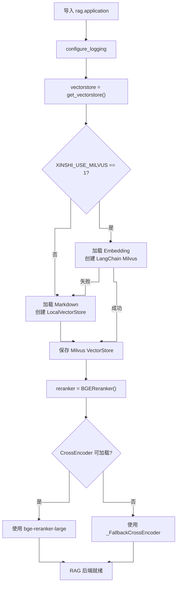
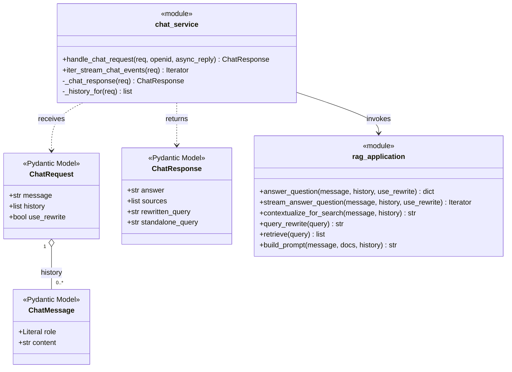
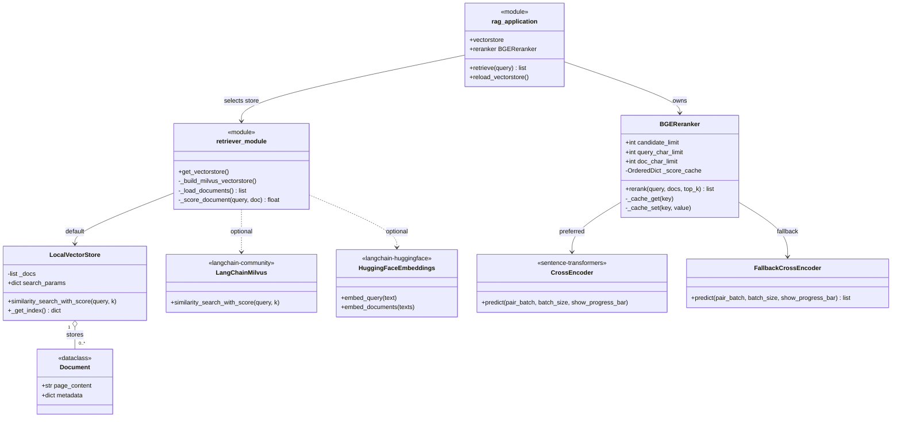
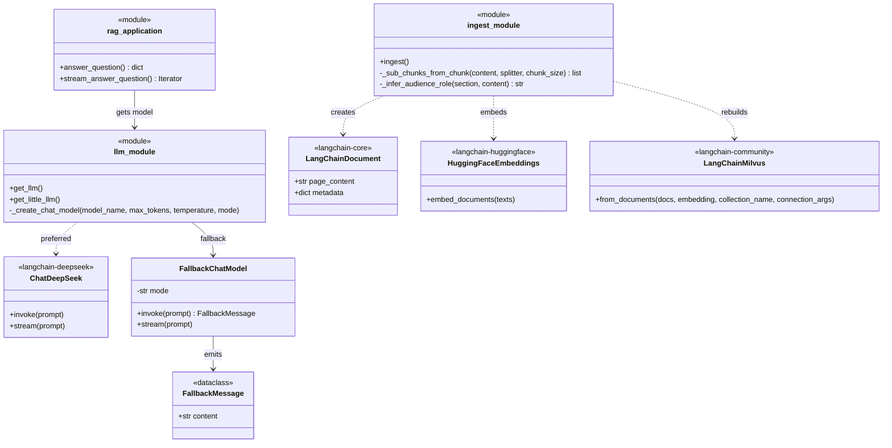
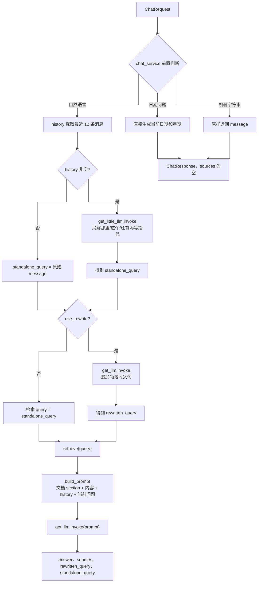
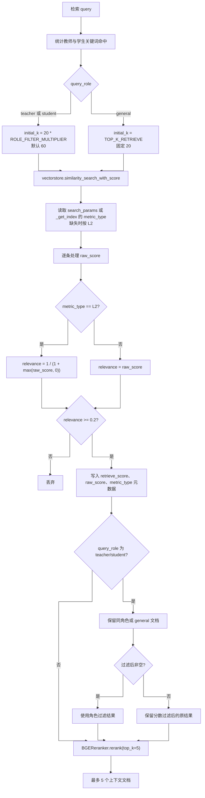
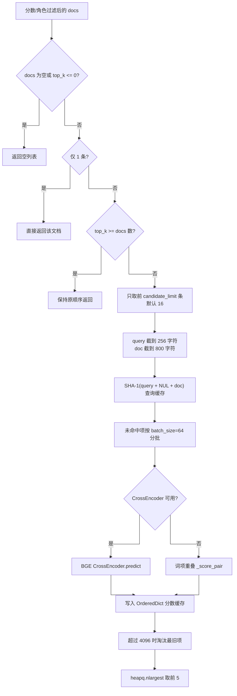
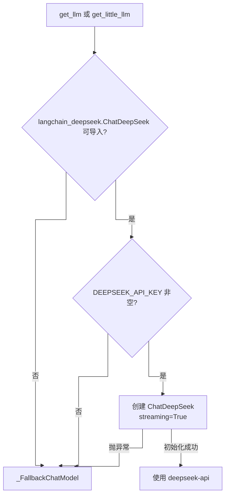
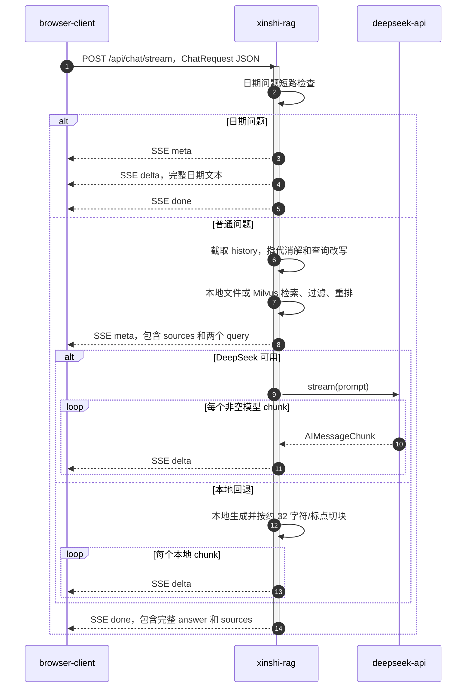
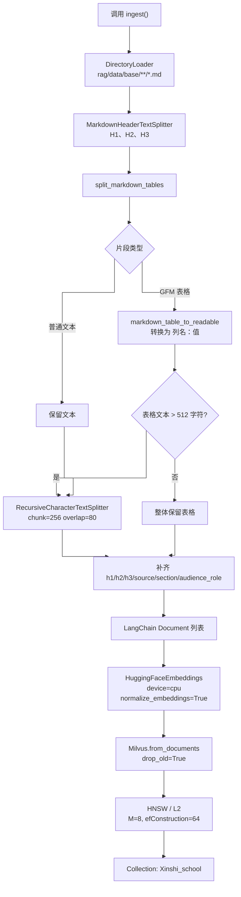

# RAG 详细设计

## 1. 范围与源码映射

RAG 功能不是单个类，而是多个 Python 模块、真实类和 LangChain 外部类型共同完成。

| 层次 | 实现 | 核心职责 |
|---|---|---|
| 请求模型 | [`rag/schemas.py`](../../rag/schemas.py) | 定义消息、请求和响应结构 |
| 聊天前置编排 | [`rag/chat_service.py`](../../rag/chat_service.py) | 日期短路、机器字符串短路、历史转换、同步/流式入口 |
| RAG 主编排 | [`rag/application.py`](../../rag/application.py) | 指代消解、查询改写、检索、过滤、重排、提示词、生成 |
| 向量/本地检索 | [`rag/retriever.py`](../../rag/retriever.py) | 选择 Milvus 或 `LocalVectorStore`，实现本地文档加载和相似度 |
| 重排 | [`rag/reranker.py`](../../rag/reranker.py) | CrossEncoder 重排、输入截断、批处理、分数缓存和回退 |
| LLM 适配 | [`rag/llm.py`](../../rag/llm.py) | `ChatDeepSeek` 创建和本地 `_FallbackChatModel` |
| 索引构建 | [`rag/ingest.py`](../../rag/ingest.py) | Markdown 切分、Embedding、Milvus Collection 全量重建 |
| 表格处理 | [`rag/md_table.py`](../../rag/md_table.py) | 保持 GFM 表格完整并转换为可检索中文描述 |

当前公开的 JSON 问答接口只有流式 `POST /api/chat/stream`。非流式 `answer_question()` 是内部/CLI 能力，也由微信后台任务调用；`POST /api/chat` 是微信加密消息接口，不是普通 JSON 问答接口。

## 2. 启动和对象生命周期

导入 `rag.application` 时立即执行以下初始化：

`vectorstore` 和 `reranker` 是模块级单例式对象，仅在当前 Python 进程内共享。`reload_vectorstore()` 只替换 `vectorstore`，不会重新创建 Reranker。

## 3. RAG 实现类图

图中带 `<<module>>` 的元素代表真实 Python 模块及其模块函数，不代表代码中存在同名类；其余元素是当前代码或直接依赖中真实存在的类。为避免横向过扁和连线交叉，按职责拆成三张纵向类图。

### 3.1 请求模型与问答编排

### 3.2 检索与重排类型

### 3.3 LLM 与索引构建类型

### 3.4 类图真实性说明

1. `rag.application`、`rag.retriever`、`rag.llm`、`rag.ingest` 都是函数式模块，没有对应的 `ApplicationService`、`RetrieverService` 或 `IngestService` 类。
2. `rag.retriever.Document` 是项目定义的本地回退数据类；`rag.ingest` 使用的是 `langchain_core.documents.Document`，二者不是同一个类型。
3. Milvus 模式使用 LangChain Community 的 `Milvus` VectorStore；`rag/milvus.py` 中的 `_CollectionRegistry` 和 `drop_collection()` 不在问答或 `ingest.py` 主调用链上。
4. `BGEReranker` 持有的模型在运行时二选一：`sentence_transformers.CrossEncoder` 或 `_FallbackCrossEncoder`。
5. LLM 运行时二选一：`ChatDeepSeek` 或 `_FallbackChatModel`。

## 4. 普通问答流程

`answer_question()` 用于微信后台问答、GET 校验自然语言扩展分支和 CLI。处理顺序如下：

### 4.1 多轮历史

- `ChatRequest.history` 按时间顺序传入，不包含当前 `message`。
- `chat_service._history_for()` 和 `application` 都限制为最近 `MAX_HISTORY_MESSAGES=12` 条。
- 历史只保存在请求中，服务端没有会话 ID、内存会话表或数据库持久化。
- 指代消解使用 `get_little_llm()`；如果没有历史，完全跳过该模型调用。
- 微信入站当前不传历史，所以微信主路径不执行指代消解模型。

### 4.2 查询改写

`query_rewrite()` 使用 `get_llm()`，不是 `get_little_llm()`。提示词明确包含地址、面积、校长、师资、费用、招生等规则。LLM 不可用时，本地 `_expand_query()` 对相同主题追加固定同义词。

`_ALUMNI_QUERY_KEYWORDS` 和 `_ALUMNI_REWRITE_TERMS` 虽在 `application.py` 中定义，但当前没有被任何函数引用，不属于有效检索逻辑。

## 5. 检索与过滤流程

### 5.1 角色识别

| 角色 | 查询关键词示例 | 文档元数据 |
|---|---|---|
| `teacher` | 老师、教师、班主任、师资、教职工、名师 | 索引/本地加载阶段计算 `audience_role=teacher` |
| `student` | 学生、同学、学子、招生、报名、宿舍、食宿 | `audience_role=student` |
| `general` | 两类命中相同或均未命中 | `audience_role=general` |

角色过滤具有“非空才生效”的回退：如果过滤后没有任何文档，则继续使用过滤前候选，避免直接变成空上下文。

### 5.2 本地检索算法

`LocalVectorStore` 不生成向量。它执行以下词法检索：

1. 从查询和文档中抽取连续中文词或字母数字词；
2. 对长度至少 3 的中文词补充二元词片段；
3. 计算加权词项重叠比例；
4. 计算 `SequenceMatcher` 比例并乘 0.8；
5. 取两者最大值作为本地相似度；
6. 对正分文档返回 `raw_score = 1 - similarity`，按升序取前 `k`。

因为本地 `raw_score` 对正分文档位于 `[0,1)`，后续按 L2 公式转换后的相关度大于 0.5，所以固定阈值 0.2 在本地模式下不会进一步淘汰已返回的正分文档。

## 6. 重排流程

若候选数大于 16，只有原检索顺序中的前 16 条参加重排，其余候选不会进入最终结果。缓存只缓存在当前进程内，键由截断后的 query/doc 内容计算。

## 7. 提示词与答案生成

### 7.1 提示词结构

`build_prompt()` 按以下顺序拼接：

1. 招生顾问角色和回答约束；
2. 内部参考：`[section] page_content`，文档之间空两行；
3. 最近对话：用户标为“家长”，助手标为“顾问”；
4. 当前用户原始问题，而不是改写后的检索 query。

因此，改写 query 只用于召回，最终回答仍围绕用户原话，减少改写词直接污染答案的风险。

### 7.2 LLM 选择

| 用途 | 默认模型名 | 默认 max tokens | 默认 temperature |
|---|---|---:|---:|
| 正式回答、查询改写 | `deepseek-chat` | 1024 | 0.0 |
| 多轮指代消解 | `deepseek-v4-flash` | 至少 128 | 0.2 |

两个模型实际都读取同一个 `DEEPSEEK_MAX_TOKENS` 环境变量；如果该变量在 `.env.example` 中设置为 1024，`get_little_llm()` 也会使用 1024，而不是函数参数中的默认 128。

### 7.3 本地 LLM 回退

本地回退不是生成式模型：

- 查询改写：按固定主题追加同义词；
- 指代消解：直接返回当前问题，不能真正消解上下文指代；
- 答案生成：按词项从内部参考中挑选最多两句；
- 无可用句子：返回“目前资料里没看到对应信息，建议通过官方渠道确认”。

## 8. SSE 流式问答

### 8.1 服务级时序

### 8.2 SSE 事件结构

| `type` | 时机 | 主要字段 |
|---|---|---|
| `meta` | 检索完成、答案生成前 | `sources`、`rewritten_query`、`standalone_query` |
| `delta` | 每个非空文本块 | `content` |
| `done` | 正常生成结束 | `answer`、`sources` |
| `error` | `iter_stream_chat_events` 捕获异常 | `detail` |

流式入口只对日期问题做短路；它没有调用 `is_non_natural_language_message()`，所以机器字符串通过流式接口提交时仍会进入 RAG。

## 9. 索引构建流程

### 9.1 触发方式差异

| 触发方式 | 等待方式 | 结果 |
|---|---|---|
| 上传接口 `reindex=true` | HTTP 请求使用 executor 等待 `ingest()` 和 `reload_vectorstore()` 完成 | 响应返回 `reindex_status` |
| `POST /api/docs/reindex` | `asyncio.create_task` 后立即返回 accepted | 通过状态接口轮询 |
| 直接运行 `python -m rag.ingest` | 前台同步 | 只重建 Milvus，不调用 `reload_vectorstore()` |

### 9.2 上传与索引的实际数据边界

- 上传文件保存在 `rag/data/docs`；
- `ingest()` 只读取 `rag/data/base`；
- `DirectoryLoader` glob 只匹配 `*.md`；
- 因此上传 `.md` 后执行 `reindex=true` 也不会把该上传文件写入 Milvus；
- 上传 `.txt` 在当前本地检索和 Milvus 索引路径中都不会被读取。

## 10. 核心参数

| 参数 | 默认值 | 来源 | 作用 |
|---|---:|---|---|
| `MAX_HISTORY_MESSAGES` | 12 | `config.py` 常量 | 进入改写/提示词的历史消息上限 |
| `TOP_K_RETRIEVE` | 20 | `config.py` 常量 | 通用问题初始召回数 |
| `ROLE_FILTER_MULTIPLIER` | 3 | 环境变量 | 教师/学生问题初始召回放大到默认 60 |
| `_RETRIEVE_SCORE_THRESHOLD` | 0.2 | `application.py` 常量 | 相关度过滤阈值 |
| `TOP_K_RERANK` | 5 | `config.py` 常量 | 最终上下文文档上限 |
| `RERANK_CANDIDATE_LIMIT` | 16 | 环境变量 | 参加 CrossEncoder 的候选上限 |
| `RERANK_BATCH_SIZE` | 64 | 环境变量 | CrossEncoder predict 批大小 |
| `RERANK_MAX_LENGTH` | 256 | 环境变量 | CrossEncoder tokenizer 最大长度 |
| `RERANK_QUERY_CHAR_LIMIT` | 256 | 环境变量 | 重排 query 字符截断 |
| `RERANK_DOC_CHAR_LIMIT` | 800 | 环境变量 | 重排文档字符截断 |
| `RERANK_SCORE_CACHE_SIZE` | 4096 | 环境变量 | 进程内重排分数缓存上限 |
| Milvus chunk size/overlap | 256/80 | `ingest.py` 常量 | 索引文档切分 |
| Local chunk size/overlap | 900/120 | `retriever.py` 默认参数 | 本地回退文档切分 |

## 11. 异常、回退与一致性

| 失败点 | 当前行为 | 是否继续服务 |
|---|---|---|
| Milvus 依赖不可导入 | `get_vectorstore()` 回退本地文件检索 | 是 |
| Milvus 连接/Embedding 初始化失败 | 记录 warning 并回退本地检索 | 是 |
| CrossEncoder 不可导入或模型加载失败 | 使用 `_FallbackCrossEncoder` | 是 |
| DeepSeek 依赖、Key 或初始化不可用 | 使用 `_FallbackChatModel` | 是 |
| DeepSeek 请求在 `invoke/stream` 期间失败 | 向上抛出；同步入口报错，流式入口输出 `error` | 部分 |
| Milvus `ingest()` 失败 | 重建状态记录 error；旧内存 vectorstore 不刷新 | 旧查询路径可能继续 |
| 本地 Markdown 读取失败 | 跳过该文件 | 是，但知识可能缺失 |

## 12. 当前实现边界

1. 没有检索结果去重、来源 URL、页码或文档版本字段；`sources` 只返回 `metadata.section`。
2. 没有对 DeepSeek 调用做业务级超时、重试、熔断或并发限制。
3. `retrieve()` 的分数阈值对不同 metric 直接复用；非 L2 情况把 raw score 直接当相关度，要求底层分值方向与阈值语义一致。
4. Reranker 返回的文档没有写入 `rerank_score`，最终响应无法展示重排分数。
5. Milvus 重建使用 `drop_old=True`，没有灰度索引、双写、原子别名切换或回滚。
6. 本地检索和 Milvus 检索使用不同数据范围、切分粒度和评分机制，同一问题在两种模式下可能产生明显不同的答案。
7. 当前默认配置未设置 `XINSHI_USE_MILVUS=1`，因此默认运行路径是本地词法检索，而不是 Milvus 向量检索。
