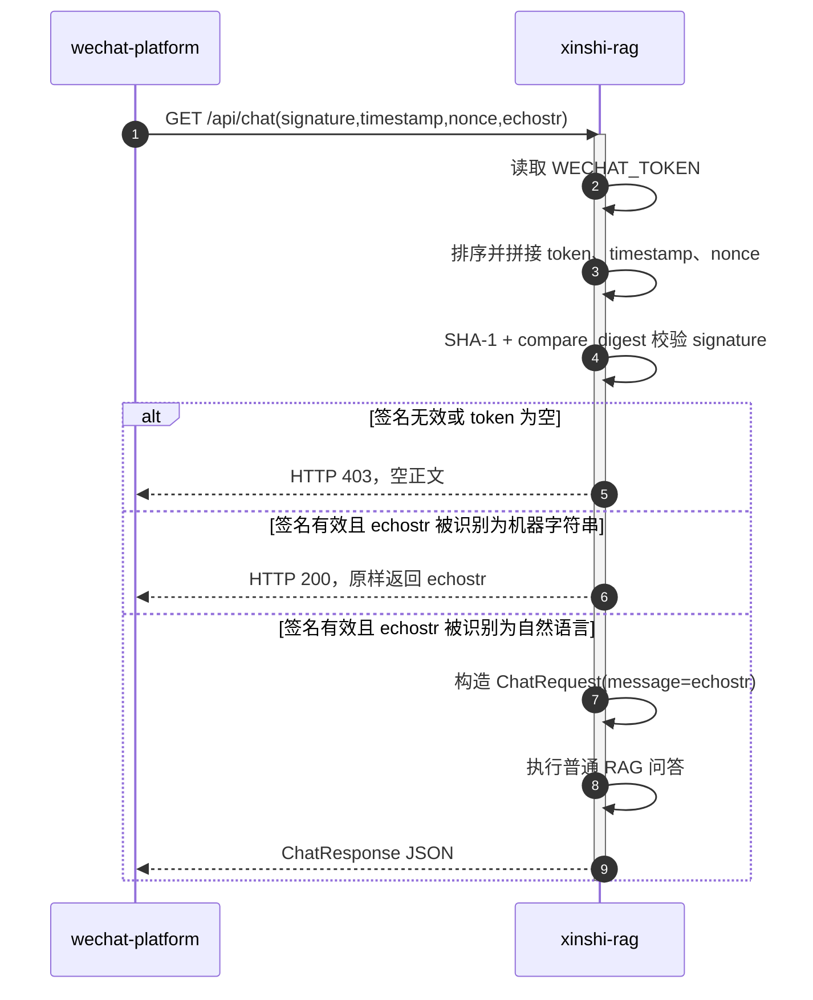
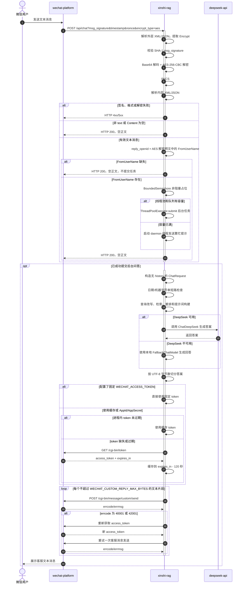
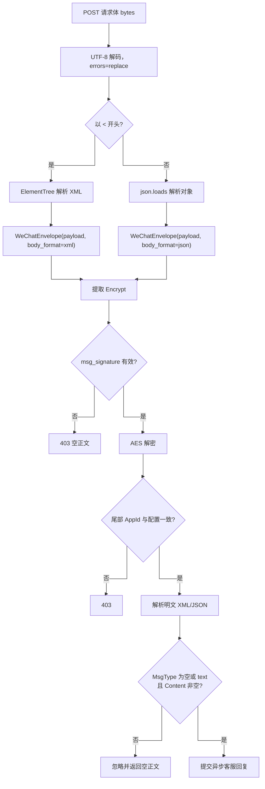
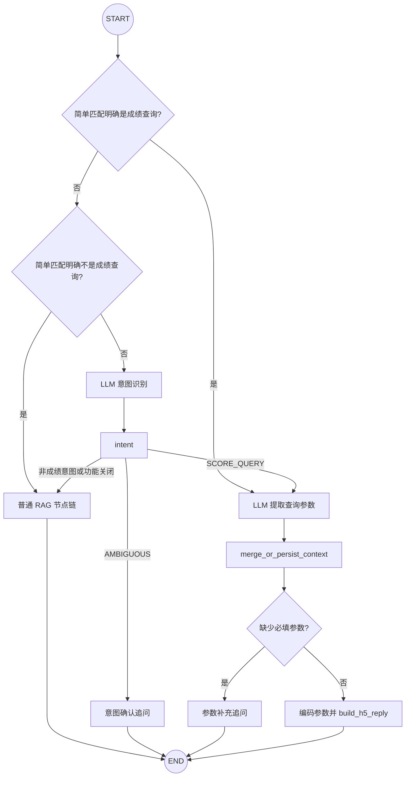
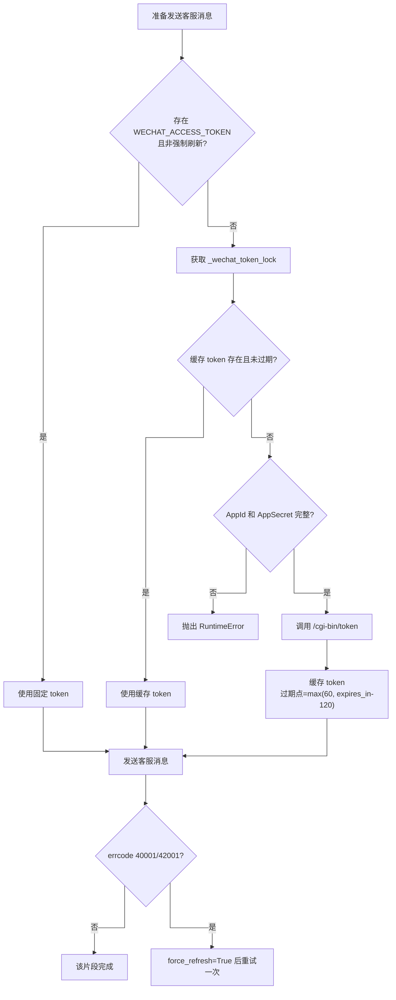

# 微信交互详细设计

| 项目 | 内容 |
|---|---|
| 文档版本 | V1.3（统一 LangGraph 成绩查询编排） |
| 日期 | 2026-08-31 |
| 涉及模块 | `rag.server`、`rag.wechat_service`、`rag.wechat_crypto`、`rag.chat_service`、`rag.score_query_graph` |

## 1. 实现范围

微信交互由三个模块共同实现：

| 模块 | 职责 | 源码 |
|---|---|---|
| `rag.server` | 暴露 `GET/POST /api/chat`，转换 HTTP 异常和响应 | [`rag/server.py:111`](../../rag/server.py#L111) |
| `rag.wechat_service` | 解析外层/内层 XML 或 JSON、提取密文、过滤消息类型、提交异步问答 | [`rag/wechat_service.py:68`](../../rag/wechat_service.py#L68) |
| `rag.wechat_crypto` | URL/消息签名校验、AES-CBC 解密、PKCS#7 去填充、AppId 校验 | [`rag/wechat_crypto.py:35`](../../rag/wechat_crypto.py#L35) |
| `rag.chat_service` | 线程池、队列容量、RAG 调用、access_token 缓存和客服消息发送 | [`rag/chat_service.py:163`](../../rag/chat_service.py#L163) |
| `rag.score_query_graph` | 为统一 Graph 提供三级成绩意图、LLM 参数提取、补齐和 H5 回复节点 | [`rag/score_query_graph.py`](../../rag/score_query_graph.py) |
| `rag.application` | 编译唯一的 `xinshi-unified-chat` Graph，并路由成绩与普通 RAG 分支 | [`rag/application.py`](../../rag/application.py) |

当前只处理文本消息。非文本消息或缺少 `Content` 的消息被忽略，HTTP 返回空正文；没有实现图片、语音、事件订阅或被动加密回复。

## 2. 微信交互总体流程

```mermaid
%%{init: {"flowchart": {"curve": "stepBefore", "nodeSpacing": 50, "rankSpacing": 65}}}%%
flowchart TD
    config["微信配置服务器 URL"] --> verify["GET /api/chat<br/>URL 签名校验"]
    verify -->|"校验通过"| enabled["微信服务器配置生效"]
    verify -->|"校验失败"| rejected["HTTP 403 空正文"]

    userMsg["用户向公众号发送消息"] --> encryptedPost["wechat-platform 推送<br/>POST /api/chat 加密报文"]
    encryptedPost --> parse["解析 XML/JSON 外层信封"]
    parse --> signature["校验 msg_signature"]
    signature --> decrypt["AES-CBC 解密、PKCS#7 去填充、AppId 校验"]
    decrypt --> textCheck{"MsgType 为 text<br/>且 Content 非空?"}
    textCheck -->|"否"| emptyAck["HTTP 200 空正文"]
    textCheck -->|"是"| queue["尝试占用线程池队列槽位"]
    queue --> immediateAck["HTTP 200 空正文"]
    queue -->|"有槽位"| graph["后台执行统一 LangGraph"]
    graph -->|"普通意图"| rag["在同一 Graph 执行普通 RAG 分支"]
    graph -->|"成绩查询"| customerApi
    queue -->|"无槽位"| busy["后台发送繁忙提示"]
    rag --> customerApi["调用微信客服消息 API"]
    busy --> customerApi
    customerApi --> userReply["用户收到文本回复"]
```

## 3. UC-WX-01：微信服务器 URL 校验

### 3.1 请求

`wechat-platform` 调用：

```text
GET /api/chat?signature=...&timestamp=...&nonce=...&echostr=...
```

签名计算规则来自 `url_signature()`：对 `WECHAT_TOKEN`、`timestamp`、`nonce` 三个字符串排序、拼接并计算 SHA-1，再用 `hmac.compare_digest` 与请求中的 `signature` 比较。

### 3.2 服务级时序图



### 3.3 `echostr` 分支的实际规则

`is_non_natural_language_message()` 将以下内容倾向识别为机器字符串并直接返回：

- UUID；
- 纯数字；
- 长度至少 8 的十六进制字符串；
- 长度至少 12 的 Base64 风格字符串；
- 长度至少 16，或包含数字/分隔符的 ASCII token。

含中文、空白或问号/感叹号的字符串会被视为自然语言。正常微信校验的 `echostr` 通常属于机器字符串，所以真实主路径是原样返回；自然语言分支是当前代码保留的非标准扩展。

## 4. UC-WX-02/03：加密文字消息与异步客服回复

### 4.1 入站请求约束

`POST /api/chat` 要求查询参数：

| 参数 | 必填 | 用途 |
|---|---|---|
| `msg_signature` | 是 | 对 `token + timestamp + nonce + Encrypt` 计算的消息签名 |
| `timestamp` | 是 | 签名和回复报文时间戳 |
| `nonce` | 是 | 签名随机数 |
| `signature` | 否 | 兼容微信请求但不参与 POST 鉴权，不记录其值 |
| `encrypt_type` | 否 | 出现时必须等于 `aes` |

回复目标只能来自 AES 解密后的 `FromUserName`。请求 query 不接受、不信任 OpenID；解密明文缺少 `FromUserName` 时直接忽略消息，不提交异步任务。

请求体可为 XML 或 JSON，但外层必须包含非空字符串字段 `Encrypt`。内部解密后的明文也可为 XML 或 JSON。

### 4.2 完整交互时序图



### 4.3 为什么立即返回空正文

`build_encrypted_chat_reply()` 对有效文字消息只负责提交异步任务，随后返回 `None`。`server.chat_wechat_message()` 收到 `None` 后返回空 `PlainTextResponse`。因此：

- 入站 HTTP 请求不等待 RAG 和 DeepSeek；
- 最终答案不是微信被动回复报文，而是通过客服消息 API 主动发送；
- `render_encrypted_envelope()` 和加密回复工具函数当前不在有效文本主路径上产生输出。

## 5. 应用内处理流程



### 5.1 统一 LangGraph 中的成绩查询分支

成绩查询和普通 RAG 由 `rag.application` 中同一张 `StateGraph` 编排，一次微信消息只执行一次 `invoke`。成绩意图命中后调用参数 LLM，缺少必填参数时追问并通过可信 OpenID 对应的后端上下文合并，参数完整后拼接固定入口。微信验签、解密、ACK、队列和客服 API 均不进入 Graph。



路由约束：

- `classify_intent` 只使用条件边，不再叠加普通出边；
- 简单规则先确认 `SCORE_QUERY`，再确认明确的非查询意图，只有两者都不确定时调用意图 LLM；
- 成绩查询必须调用参数 LLM；缺少姓名、时间范围或考试类型时追问，完整后才返回链接；
- 参数由服务端执行严格 JSON、类型、枚举和长度校验，并使用 URL 编码拼接；
- 普通招生问答、制度咨询、教师录入操作直接进入普通 RAG；
- H5 地址由固定配置提供并校验路径和唯一 `appid`，不由模型生成；
- LangGraph 作为直接运行时依赖固定为 `1.2.11`，与 `langchain==1.3.17` 的约束一致。

## 6. 并发与容量控制

### 6.1 当前实现

模块导入时创建：

- `ThreadPoolExecutor(max_workers=WECHAT_CUSTOM_REPLY_WORKERS)`；
- `BoundedSemaphore(workers + queue_size)`；
- 每次提交前使用 `acquire(blocking=False)`；
- Future 完成回调释放信号量。

| 参数 | 代码默认值 | `.env.example` 值 | 说明 |
|---|---:|---:|---|
| `WECHAT_CUSTOM_REPLY_WORKERS` | 6 | 2 | 同时执行的后台问答线程数 |
| `WECHAT_CUSTOM_REPLY_QUEUE_SIZE` | 150 | 未配置，使用 150 | 等待队列容量 |
| `WECHAT_CUSTOM_REPLY_TIMEOUT` | 10 秒 | 10 秒 | 微信 token/客服 HTTP 请求超时 |
| `WECHAT_CUSTOM_REPLY_MAX_BYTES` | 1800 | 1800 | 每段客服文本的 UTF-8 字节上限 |

当容量用尽时，原消息仍会收到 HTTP 200 空正文；应用另起 daemon 线程发送“当前咨询人数较多，请稍后再试”。该繁忙通知线程不受同一个信号量约束。

## 7. access_token 设计



固定 `WECHAT_ACCESS_TOKEN` 在正常调用时优先级最高；但若固定 token 触发 40001/42001，强制刷新分支会绕过固定 token，并要求 `WECHAT_APPID/WECHAT_APPSECRET` 可用。

## 8. 异常与降级矩阵

| 场景 | 当前处理 | 对微信用户的结果 |
|---|---|---|
| `encrypt_type` 非 `aes` | HTTP 400 | 本轮不处理 |
| 请求体为空或 XML/JSON 非法 | HTTP 400 | 本轮不处理 |
| 缺少 `Encrypt` | HTTP 400 | 本轮不处理 |
| `msg_signature` 无效 | HTTP 403 空正文 | 本轮不处理 |
| AES 配置/依赖错误 | HTTP 500 | 本轮不处理 |
| AppId 不匹配 | HTTP 403 | 本轮不处理 |
| 非文本消息或内容为空 | HTTP 200 空正文 | 无回复 |
| 解密明文缺少 `FromUserName` | 忽略消息，不提交异步任务 | 无客服回复 |
| 异步容量已满 | 尝试另起线程发送繁忙提示 | 可能收到繁忙提示 |
| RAG 生成失败 | 尝试发送固定失败文案 | 可能收到“暂时处理失败” |
| token 获取失败 | 后台记录异常 | 无客服回复 |
| 客服消息返回非 0 errcode | 抛异常并记录日志 | 对已返回的入站请求无影响 |
| 文本超过字节上限 | 按 Unicode 字符遍历，保证片段不超过字节上限 | 收到多条客服消息 |

## 9. 安全日志与配置

以下是微信回调必须满足的安全契约：

- 不记录外层原始 XML/JSON、`Encrypt`、解密明文、解密后的完整消息对象、消息正文或客服回复正文；日志最多保留报文长度、消息类型、状态码、错误码和耗时；
- 不记录完整 `OpenID`、`FromUserName`、`ToUserName` 或手机号；如确需关联排障，只允许记录不可逆摘要；
- `POST /api/chat` 不接受 query `openid`，客服消息目标只能来自已验签、已解密的 `FromUserName`；缺少该字段必须丢弃，不允许回退到外部参数；
- `WECHAT_TOKEN`、`WECHAT_ENCODING_AES_KEY`、`WECHAT_APPID` 必须由环境变量或密钥系统注入，不设置可用的开发默认值；服务启动时缺少任一配置应失败关闭；
- `WECHAT_APPSECRET`、固定 access token、AES Key 和签名密钥不得进入异常信息、APM、请求日志或前端响应。

## 10. 当前实现边界与改造顺序

1. 微信入口不保存用户会话，入站消息构造 `ChatRequest(message=content)` 时 `history` 为空，因此公众号消息是单轮问答。
2. 异步任务和 token 缓存仅存在于进程内，重启会丢失任务和缓存。
3. 没有任务 ID、投递状态持久化、失败重试队列或死信处理。
4. 入站日志只保留长度、类型、耗时和身份摘要，不输出正文、明文或完整身份。
5. query `openid` 回退已移除，`FromUserName` 缺失时不提交客服回复任务。
6. 微信 Token、AES Key、AppId 无可用开发默认值；启用微信回调时在启动阶段校验。
7. 发送客服消息只处理文本类型，没有图文、模板消息或被动回复。
