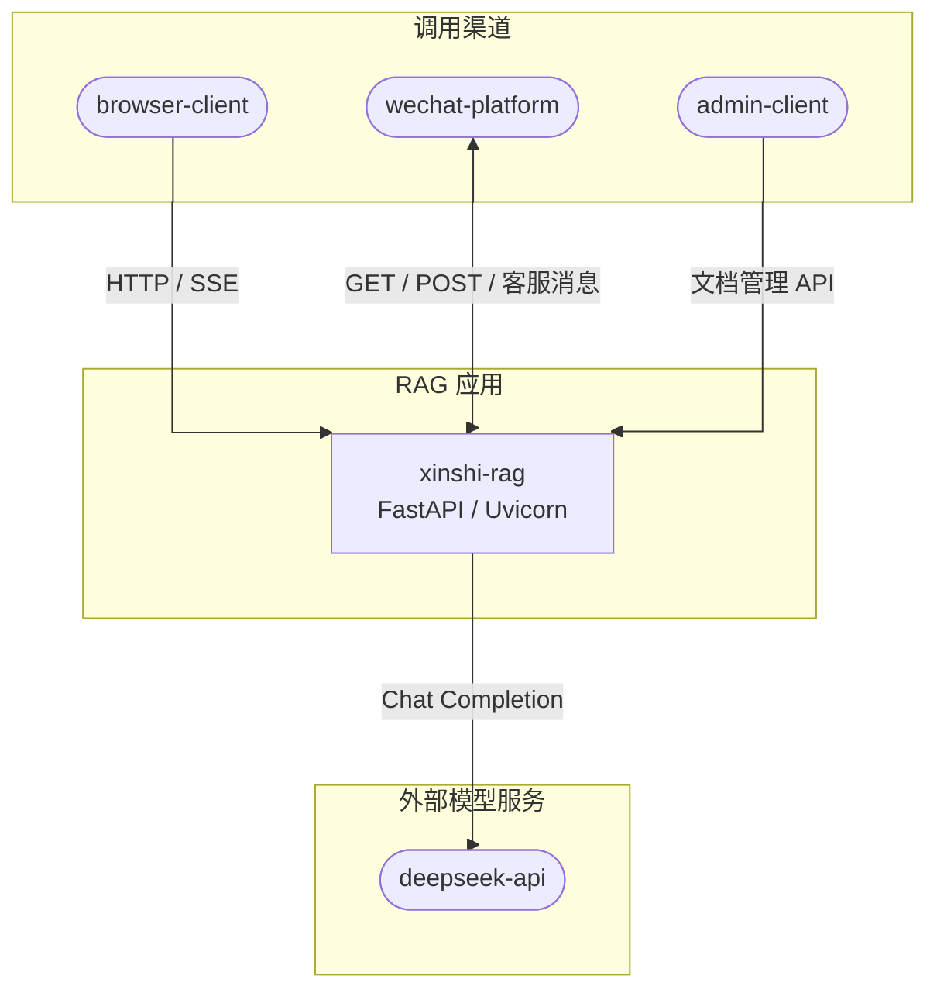
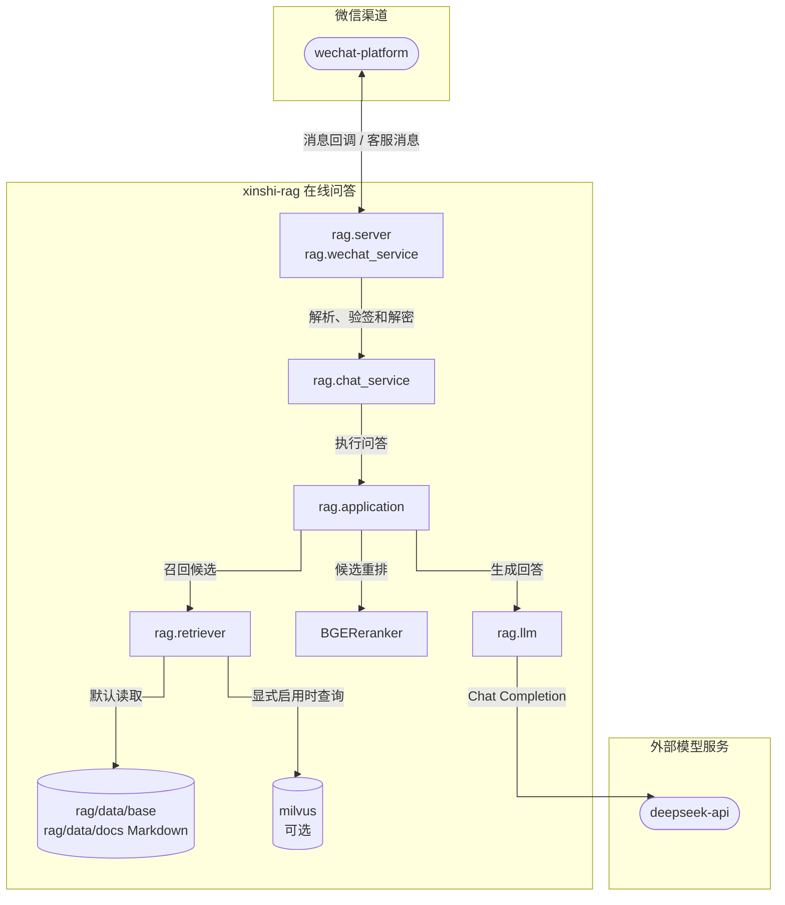
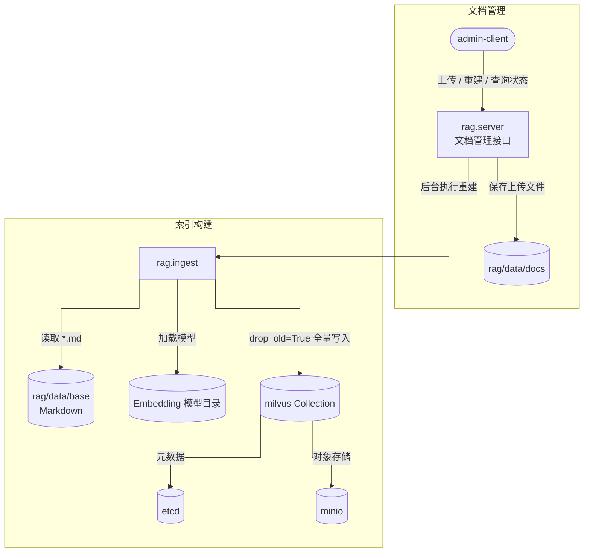
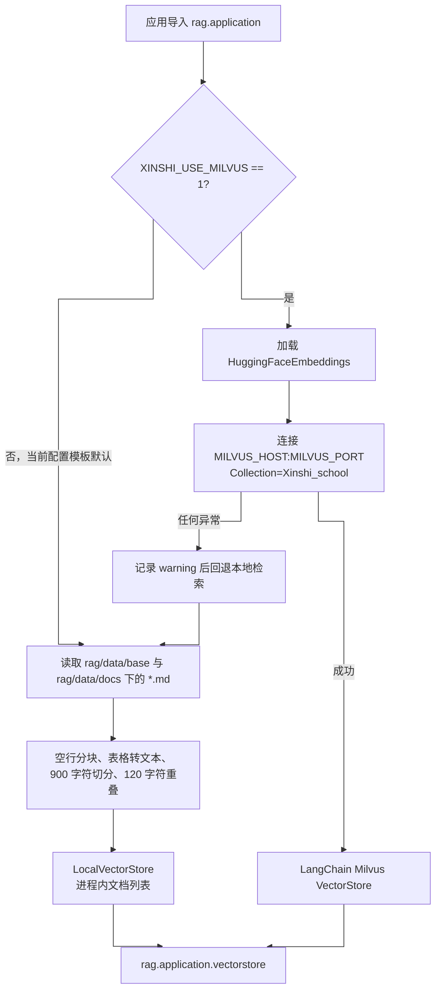
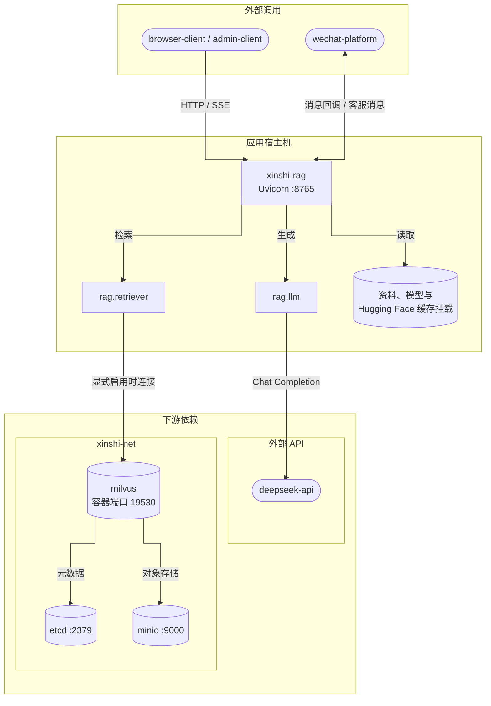
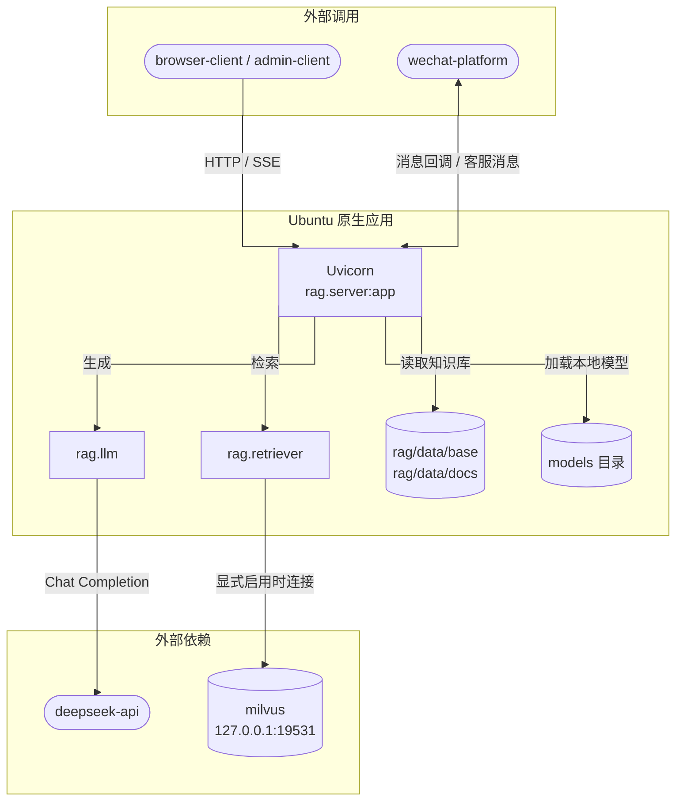

# xinshi-rag 总体架构设计

## 1. 设计依据与边界

本文档基于当前工作树中的 Python 源码和部署配置整理，主要事实来源如下：

- Web 入口与接口：[`rag/server.py`](../../rag/server.py)
- 聊天与微信异步编排：[`rag/chat_service.py`](../../rag/chat_service.py)
- RAG 主流程：[`rag/application.py`](../../rag/application.py)
- 检索实现：[`rag/retriever.py`](../../rag/retriever.py)
- 索引构建：[`rag/ingest.py`](../../rag/ingest.py)
- 重排与 LLM 适配：[`rag/reranker.py`](../../rag/reranker.py)、[`rag/llm.py`](../../rag/llm.py)
- 微信报文和密码学：[`rag/wechat_service.py`](../../rag/wechat_service.py)、[`rag/wechat_crypto.py`](../../rag/wechat_crypto.py)
- 应用和基础设施编排：[`rag/docker-install/docker-compose.yml`](../../rag/docker-install/docker-compose.yml)、[`install/milvus/docker-compose.yml`](../../install/milvus/docker-compose.yml)

本文档描述“代码已经实现的架构”。Milvus、DeepSeek、Embedding 和 Reranker 都存在本地回退或启用条件，不能把部署清单中的组件等同于每次请求都会实际调用的组件。

架构图使用兼容性较高的 Mermaid `flowchart + subgraph` 表达分层和部署边界，不依赖实验性的 `architecture-beta` 图类型。所有流程图统一设置 `curve=stepBefore`，使连线优先使用水平/垂直折线，并通过从上到下的分层减少交叉。

## 2. 系统上下文

系统有三类调用方：微信公众平台、浏览器/HTTP 客户端、文档管理调用方。应用对外只有一个 FastAPI 进程，没有独立 API 网关、消息队列或关系数据库。

### 2.1 对外能力

| 能力 | 接口 | 调用方 | 处理方式 |
|---|---|---|---|
| 微信服务器校验 | `GET /api/chat` | `wechat-platform` | 同步校验 SHA-1 签名，通常原样返回 `echostr` |
| 微信加密消息 | `POST /api/chat` | `wechat-platform` | 同步验签/解密/入队，异步 RAG 和客服消息发送 |
| 流式问答 | `POST /api/chat/stream` | `browser-client` | SSE 输出 `meta`、`delta`、`done` 或 `error` 事件 |
| 文档列表 | `GET /api/docs` | `admin-client` | 读取 `rag/data/docs` 文件目录 |
| 文档上传 | `POST /api/docs/upload` | `admin-client` | 保存 `.md`/`.txt`，最大 10 MiB，可同步等待重建 |
| 索引重建 | `POST /api/docs/reindex` | `admin-client` | 进程内 `asyncio.create_task` 后台执行 |
| 重建状态 | `GET /api/docs/reindex/status` | `admin-client` | 返回进程内状态字典 |
| 健康检查 | `GET /api/health` | 运维/探针 | 只返回进程存活状态，不探测模型、Milvus 或 DeepSeek |

## 3. 应用内部组件架构

### 3.1 在线问答组件

### 3.2 知识库构建组件

### 3.3 组件职责与调用关系

| 组件 | 真实职责 | 主要下游 |
|---|---|---|
| `rag.server` | 路由、参数接收、HTTP 响应、CORS、上传文件写盘、后台重建任务 | `wechat_service`、`chat_service`、`ingest` |
| `rag.wechat_service` | 解析外层 XML/JSON、提取 `Encrypt`、调用验签解密、过滤非文本消息 | `wechat_crypto`、`chat_service` |
| `rag.wechat_crypto` | 读取微信环境配置，完成 URL/消息签名、AES 解密和 AppId 校验 | `cryptography` |
| `rag.chat_service` | 日期/机器码短路、RAG 调用、微信线程池、token 缓存、客服消息发送 | `application`、`wechat-platform` |
| `rag.application` | 维护进程级 `vectorstore`/`reranker`，执行完整 RAG 链路 | `retriever`、`reranker`、`llm` |
| `rag.retriever` | 决定使用 Milvus 还是本地文件检索；定义本地 `Document` 和 `LocalVectorStore` | Markdown 文件、Milvus |
| `rag.reranker` | 对最多 16 个候选使用 CrossEncoder 重排并保留前 5；模型不可用时本地词项打分 | BGE 模型 |
| `rag.llm` | 创建 DeepSeek 模型；缺少 API Key、依赖或初始化失败时返回本地回退模型 | `deepseek-api` |
| `rag.ingest` | 读取基础知识库、按标题和长度切分、生成向量、全量重建 Milvus Collection | `rag/data/base`、Milvus |

## 4. RAG 数据路径

当前代码存在两条检索路径，二者的数据范围和切分规则不同。

### 4.1 有效默认行为

`rag.retriever.get_vectorstore()` 只在 `XINSHI_USE_MILVUS=1` 时尝试连接 Milvus。当前 [`rag/.env.example`](../../rag/.env.example) 和应用 Compose 都没有设置该变量，因此按仓库提供的默认配置启动时，实际使用 `LocalVectorStore`，即使 Milvus 容器已经运行。

### 4.2 数据范围差异

| 路径 | 读取目录 | 文件类型 | 切分 | 存储 |
|---|---|---|---|---|
| 本地检索 | `rag/data/base` + `rag/data/docs` | 仅 `*.md` | 空行、表格转换、900/120 字符窗口 | 进程内列表 |
| Milvus 索引构建 | 仅 `rag/data/base` | 仅 `*.md` | Markdown H1-H3、表格转换、256/80 字符窗口 | Milvus Collection |
| 上传接口 | `rag/data/docs` | `.md` 或 `.txt` | 不切分，只写文件 | 文件系统 |

由此得到两个当前边界：

1. 上传的 `.txt` 不会被本地检索器或 `ingest.py` 读取。
2. 上传到 `rag/data/docs` 的 `.md` 可被本地检索读取，但不会进入 `ingest.py` 重建的 Milvus Collection。

## 5. 部署架构

### 5.1 Docker 运行拓扑

Milvus、etcd、MinIO 使用独立 Compose；应用 Compose 只声明 `xinshi-rag`，并加入已存在的外部网络 `xinshi-net`。Milvus 宿主机默认暴露 `19531`，容器网络内部仍使用 `19530`。

### 5.2 Ubuntu 原生运行拓扑

## 6. 关键运行状态

所有状态均为单进程内存状态，没有持久化或多实例协调：

| 状态 | 所在模块 | 生命周期 | 影响 |
|---|---|---|---|
| `vectorstore` | `rag.application` | 模块导入时创建，重建后可替换 | 每个进程各自持有 |
| `reranker` 与分数缓存 | `rag.application`/`rag.reranker` | 进程生命周期 | 重启后缓存丢失 |
| 微信线程池和信号量 | `rag.chat_service` | 模块导入时创建 | 每个进程独立限流 |
| 微信 access_token 缓存 | `rag.chat_service` | 进程生命周期 | 多进程各自获取和刷新 |
| `_reindex_status` | `rag.server` | 进程生命周期 | 多实例之间不可见 |

## 7. 外部服务术语表

本文档集中的 Mermaid 图统一使用以下名称：

| 服务名称 | 说明 | 当前调用场景 |
|---|---|---|
| `xinshi-rag` | 当前 FastAPI 应用 | 微信接入、RAG 问答、文档管理 |
| `wechat-platform` | 微信公众平台及其开放 API | URL 校验、加密消息推送、token 获取、客服消息发送 |
| `deepseek-api` | DeepSeek Chat API | 指代消解、查询改写、答案生成 |
| `browser-client` | 浏览器或普通 HTTP 调用方 | 静态首页、SSE 流式问答 |
| `admin-client` | 文档管理接口调用方 | 上传、列举和重建索引 |

基础设施名称统一使用 `milvus`、`etcd`、`minio`；它们是中间件，不作为服务级业务时序图的独立参与者，涉及的内部操作以 `xinshi-rag` 自调用说明。

## 8. 架构约束与已知边界

1. 微信消息、重建状态、token 缓存和重排缓存均为进程内状态；多进程或多副本部署不会共享。
2. 微信消息异步队列是 `ThreadPoolExecutor + BoundedSemaphore`，服务重启会丢失尚未完成的任务。
3. 健康检查只证明 FastAPI 能响应，不能证明 Milvus、DeepSeek、模型文件或微信 API 可用。
4. `server.py` 定义了 `_reindex_lock`，但触发重建时未使用；“检查 running”和“后台任务置 running”之间不是原子操作。
5. Milvus 重建使用 `drop_old=True`，当前实现没有双 Collection 切换、版本化索引或事务回滚。
6. CORS 允许所有来源、方法和请求头；当前未实现普通 HTTP 接口鉴权。
7. 应用在导入 `rag.application` 时同步创建检索器和重排器，模型加载时间直接进入进程冷启动时间。
