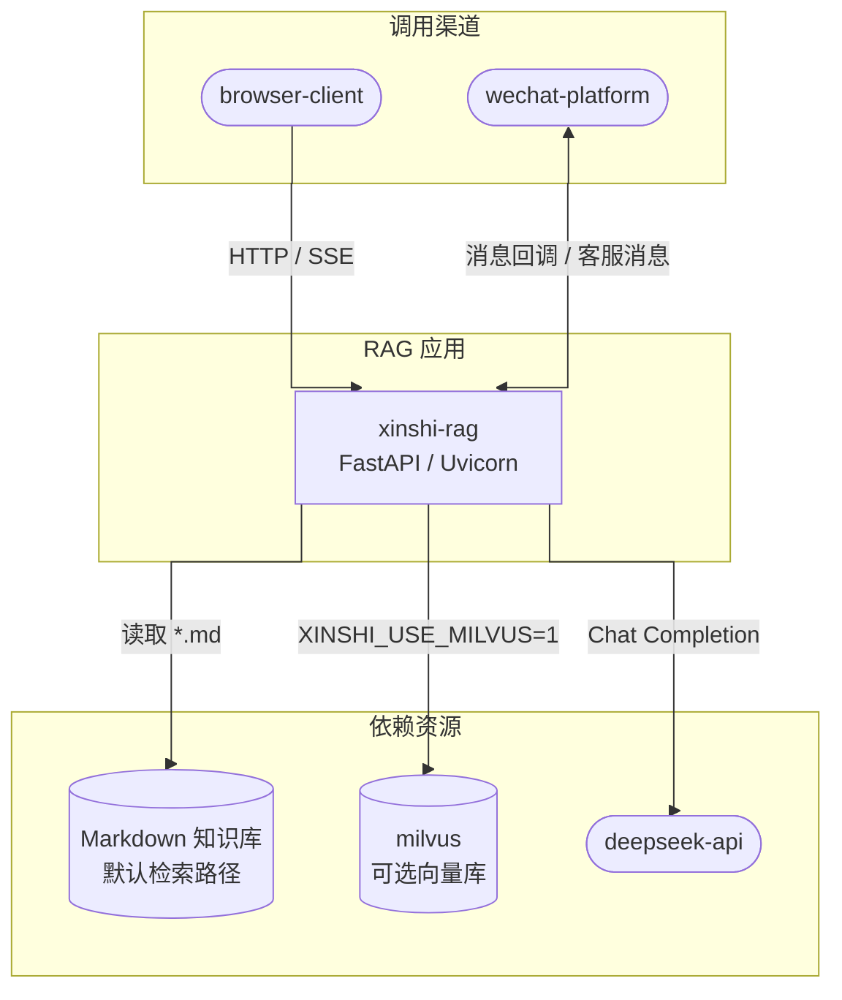

# xinshi-rag 设计概述

## 1. 文档定位

本文档描述当前仓库 `xinshi-rag` 的实际实现，不描述尚未落地的目标架构。项目是一个面向新实中学招生咨询的 Python/FastAPI 服务，包含：

- 基于 Markdown 知识库的 RAG 问答；
- 浏览器/HTTP 的普通问答和 SSE 流式问答；
- 微信公众平台服务器校验与加密消息接入；
- 微信客服消息异步回复；
- 文档列举、上传和全量索引重建；
- Milvus standalone 及其 etcd、MinIO 基础设施的独立 Docker 编排。

源码入口为 [`rag/server.py`](../../rag/server.py)，包内模块位于 [`rag/`](../../rag/)。

## 2. 代码事实范围

### 2.1 已实现的应用入口

`server.py` 创建 FastAPI 应用 `app`，当前注册的路由如下。HTTP 方法相同、路径不同的路由分别计为一个接口。

| 编号 | 方法 | 路径 | 作用 | 源码定位 |
|---|---|---|---|---|
| API-01 | GET | `/` | 返回 `static/index.html` | [`server.py:316-321`](../../rag/server.py#L316) |
| API-02 | GET | `/api/health` | 返回 `{"status":"ok"}` | [`server.py:106-108`](../../rag/server.py#L106) |
| API-03 | GET | `/api/chat` | 微信 URL 校验；自然语言 `echostr` 还会进入普通问答 | [`server.py:153-178`](../../rag/server.py#L153) |
| API-04 | POST | `/api/chat` | 接收微信加密 XML/JSON 消息并异步提交客服回复 | [`server.py:111-150`](../../rag/server.py#L111) |
| API-05 | POST | `/api/chat/stream` | HTTP JSON 请求，SSE 流式返回问答事件 | [`server.py:181-199`](../../rag/server.py#L181) |
| API-06 | GET | `/api/docs` | 列出 `data/docs` 下的文件名、大小和后缀 | [`server.py:202-212`](../../rag/server.py#L202) |
| API-07 | POST | `/api/docs/upload` | 上传 `.md`/`.txt` 文件，最大 10 MB；可选触发重建 | [`server.py:215-259`](../../rag/server.py#L215) |
| API-08 | POST | `/api/docs/reindex` | 异步触发全量向量索引重建 | [`server.py:275-305`](../../rag/server.py#L275) |
| API-09 | GET | `/api/docs/reindex/status` | 查询重建运行状态和最近结果 | [`server.py:308-313`](../../rag/server.py#L308) |

接口总数：9 个；其中 GET 6 个、POST 3 个。`/api/docs/upload` 的实际注册函数依赖 `python-multipart` 是否可导入：依赖缺失时仍注册同一路径，但返回 503。

### 2.2 代码模块划分

| 模块 | 主要文件 | 实际职责 |
|---|---|---|
| Web 接入层 | `server.py` | FastAPI 路由、CORS、请求日志、文件读写、SSE 封装、重建后台任务 |
| 请求模型 | `schemas.py` | `ChatMessage`、`ChatRequest`、`ChatResponse` Pydantic 模型 |
| 聊天编排 | `chat_service.py` | 快速返回分支、日期回答、普通问答、微信异步任务和客服消息发送 |
| RAG 应用服务 | `application.py` | 向量库冷启动、检索流水线、提示词构建、同步/流式生成 |
| 本地检索 | `retriever.py` | Markdown 加载、分段、本地词项/相似度检索、Milvus 向量库选择 |
| 索引构建 | `ingest.py` | `data/base` Markdown 加载、标题切分、表格转换、Embedding、Milvus 重建 |
| 重排 | `reranker.py` | BGE CrossEncoder 重排、批处理、LRU 风格分数缓存、本地回退 |
| LLM | `llm.py` | DeepSeek Chat 模型创建、查询改写模型、无 Key/模型失败时的本地回退 |
| 微信报文 | `wechat_service.py` | XML/JSON 信封、明文消息解析、文字消息过滤、回复构建 |
| 微信密码学 | `wechat_crypto.py` | SHA-1 签名校验、AES-256-CBC、PKCS#7、AppId 校验 |
| 表格处理 | `md_table.py` | GFM 表格识别与可读文本转换 |
| Milvus 辅助 | `milvus.py` | 独立的连接/Collection 删除辅助逻辑；当前主 RAG 路径不直接导入它 |
| 配置与日志 | `config.py`、`logutil.py` | 环境变量读取、检索/重排参数、日志格式和文本预览 |

### 2.3 未发现的实现类型

通过扫描当前 Python 源码，没有发现 MQ Consumer/Producer、定时任务、关系数据库 Repository/DAO、用户会话持久化或独立认证授权模块。当前微信异步任务使用进程内 `ThreadPoolExecutor`，不是消息队列。

## 3. 运行时技术栈

| 层次 | 当前实现 |
|---|---|
| Web | FastAPI、Uvicorn、Starlette 响应类型 |
| 请求校验 | Pydantic |
| RAG 编排 | 自定义 Python 函数 + LangChain 组件 |
| 文档加载/切分 | LangChain `DirectoryLoader`、`TextLoader`、`MarkdownHeaderTextSplitter`、`RecursiveCharacterTextSplitter` |
| Embedding | `HuggingFaceEmbeddings`，索引构建明确使用 CPU、向量归一化 |
| 向量检索 | Milvus 2.4.4（启用 `XINSHI_USE_MILVUS=1` 时）或本地文件检索回退 |
| 重排 | `sentence_transformers.CrossEncoder` 加载 BGE 模型；失败时词项重叠回退 |
| 生成/改写 | `langchain_deepseek.ChatDeepSeek`；不可用时本地 `_FallbackChatModel` |
| 微信加密 | `cryptography` AES-CBC；SHA-1/HMAC compare_digest 签名比对 |
| 基础设施 | Milvus standalone + etcd + MinIO；由 `install/milvus/docker-compose.yml` 独立管理 |

## 4. 用例划分

当前用例按四个模块划分：

| 模块 | 用例编号 | 范围 |
|---|---|---|
| RAG 问答 | UC-RAG-01 ~ UC-RAG-03 | 普通问答、流式问答、索引重建后的内存连接刷新 |
| 微信交互 | UC-WX-01 ~ UC-WX-03 | URL 校验、加密文字接入、异步客服消息 |
| 文档管理 | UC-DOC-01 ~ UC-DOC-03 | 列举、上传、触发/查询索引重建 |
| 运行支撑 | UC-SYS-01 ~ UC-SYS-02 | 健康检查、静态首页 |

完整列表见 [用例概览.md](用例概览.md)。

## 5. 当前实现的重要事实边界

以下内容是从代码路径直接推导出的实现事实，后续详细设计必须保持一致：

1. 应用启动时在 `application.py` 模块导入阶段创建 `vectorstore` 和 `BGEReranker`；模型/向量库加载属于冷启动路径。
2. `get_vectorstore()` 只有在环境变量 `XINSHI_USE_MILVUS=1` 时尝试构造 Milvus；失败后或未开启时使用 `LocalVectorStore`。
3. 本地检索器扫描 `data/base` 和 `data/docs` 下的 `*.md`，按空行分块，再做表格转换和长度切分；它不是 Milvus 的查询代理。
4. `ingest.py` 只扫描 `rag/data/base` 下的 `*.md`，并使用 `Milvus.from_documents(..., drop_old=True)` 全量替换 Collection；它不会扫描 `data/docs`。
5. 因此，上传到 `data/docs` 的文件在本地回退检索路径可被读取，但当前 `ingest.py` 的 Milvus 重建路径不会将其纳入索引。这是当前代码的路径边界，不在本文档中假设为已解决。
6. 微信 POST 收到文字消息后立即返回空响应，RAG 处理和客服消息发送在线程池中异步执行；微信消息没有从入站报文中构造 `history`，当前微信入口按单轮消息处理。
7. 微信客服消息文本按 UTF-8 字节数切分，默认每段最大 1800 字节；发送时遇到 `errcode` 40001/42001 会刷新 token 后重试一次。
8. `server.py` 定义了 `_reindex_lock`，但当前触发逻辑只检查 `_reindex_status["running"]`，没有使用该锁保护检查与置位。
9. CORS 当前配置为允许任意来源、任意方法和任意请求头；微信签名校验与 AES 报文校验是单独的微信安全边界。

## 6. 全局视图 Mermaid

下面的图只表达当前代码中存在的主要运行关系；完整架构见 [总体架构.md](总体架构.md)，类级细节见 [RAG 实现类图](RAG详细设计.md#3-rag-实现类图)。

其中 Markdown 本地检索是当前配置模板的默认路径；`milvus` 连接只在显式设置 `XINSHI_USE_MILVUS=1` 时启用。

## 7. 文档生成进度

| 阶段 | 内容 | 状态 |
|---|---|---|
| 全局视图 | 项目入口、模块、依赖、接口和用例盘点 | 已完成 |
| RAG 模块 | 检索、重排、生成、索引构建详细设计 | 已完成 |
| 微信模块 | 加密接入、异步回复、客服 API 详细设计 | 已完成 |
| 总体架构与部署 | 组件关系、检索模式、Docker/Ubuntu 拓扑和边界 | 已完成 |
| 全量接口设计 | 请求/响应示例和字段级错误码 | 待补充 |
