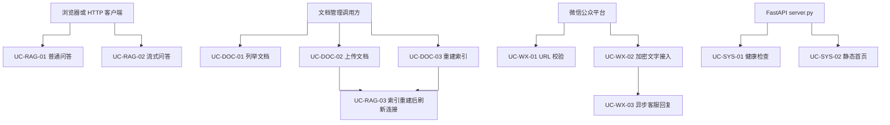

# 用例概览

## 1. 统计

| 项目 | 数量 | 统计口径 |
|---|---:|---|
| API 接口 | 9 | `server.py` 中当前注册的 HTTP 路由 |
| 消息消费用例 | 0 | 未发现 MQ Consumer；微信 HTTP POST 计入微信交互用例 |
| 消息生产用例 | 0 | 未发现 MQ Producer；微信客服消息是 HTTPS API 调用 |
| 定时任务 | 0 | 未发现 Scheduler/Job |
| 业务用例 | 11 | 下表按用户可观察的功能和关键后台流程拆分 |

接口方法统计：GET 6 个，POST 3 个。`/api/docs/upload` 计为一个接口，是否能执行上传取决于运行环境是否安装 `python-multipart`。

## 2. 用例列表

| 编号 | 模块 | 用例 | 入口 | 主要实现 |
|---|---|---|---|---|
| UC-RAG-01 | RAG 问答 | 普通同步问答 | `POST /api/chat` 之外的内部调用、`GET /api/chat` 自然语言分支 | `chat_service._chat_response` → `application.answer_question` |
| UC-RAG-02 | RAG 问答 | HTTP SSE 流式问答 | `POST /api/chat/stream` | `server.chat_stream` → `iter_stream_chat_events` → `stream_answer_question` |
| UC-RAG-03 | RAG 问答 | 索引完成后刷新向量库连接 | 上传时 `reindex=true` 或 `POST /api/docs/reindex` | `ingest.ingest` → `application.reload_vectorstore` |
| UC-WX-01 | 微信交互 | 微信服务器 URL 校验 | `GET /api/chat` | `wechat_crypto.verify_url_signature` |
| UC-WX-02 | 微信交互 | 微信 AES 加密文字消息接入 | `POST /api/chat` | `wechat_service.build_encrypted_chat_reply` |
| UC-WX-03 | 微信交互 | 异步生成并发送客服文本 | UC-WX-02 的线程池后台流程 | `chat_service._try_submit_wechat_async_reply` → `_send_wechat_customer_text` |
| UC-DOC-01 | 文档管理 | 列举上传文档目录 | `GET /api/docs` | `server.list_docs` |
| UC-DOC-02 | 文档管理 | 上传 Markdown/TXT 文档 | `POST /api/docs/upload` | `server.upload_doc` |
| UC-DOC-03 | 文档管理 | 异步触发并查询全量重建 | `POST/GET /api/docs/reindex*` | `server.trigger_reindex`、`server.reindex_status` |
| UC-SYS-01 | 运行支撑 | 健康检查 | `GET /api/health` | `server.health` |
| UC-SYS-02 | 运行支撑 | 返回前端静态首页 | `GET /` | `server.index_page` |

## 3. 用例与源码关系

## 4. 编号说明

- `UC-RAG-*`：RAG 问答和索引刷新。
- `UC-WX-*`：微信平台交互及客服回复。
- `UC-DOC-*`：知识文档目录和索引管理。
- `UC-SYS-*`：运行支撑接口。

编号不是代码中的标识符，仅用于本文档检索；实际实现以源码函数和路由为准。
