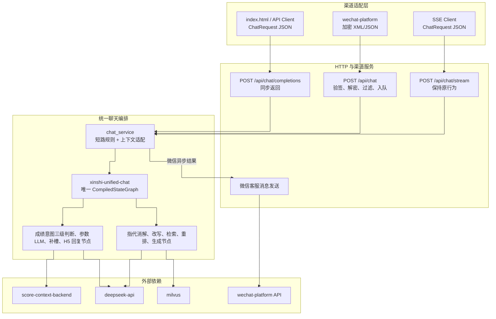
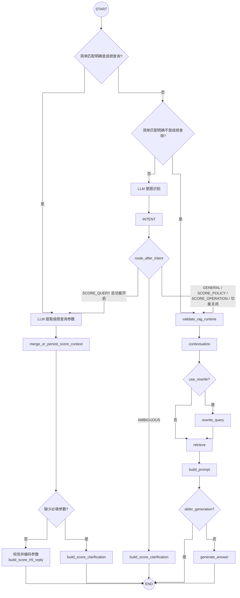
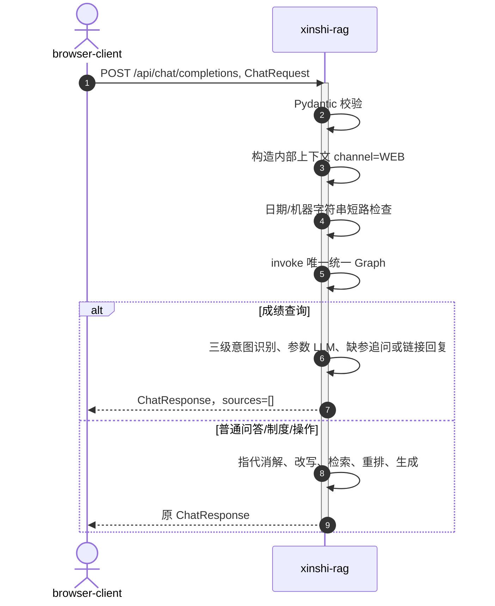
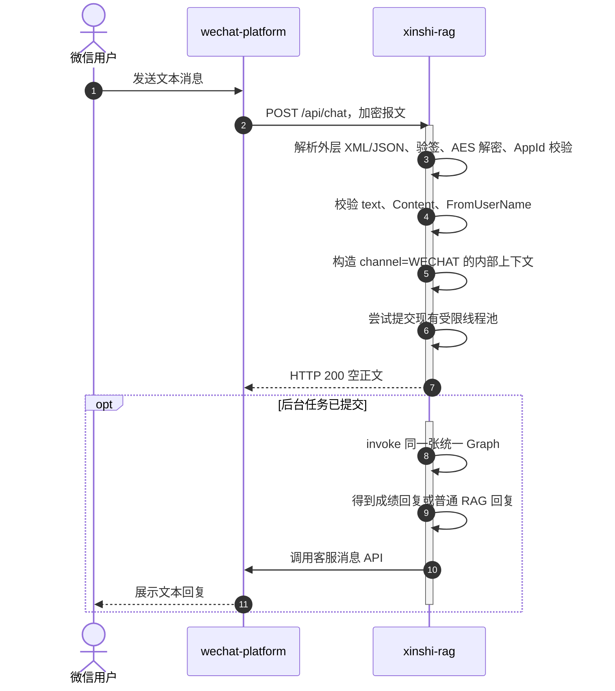

# 统一 RAG 与成绩查询意图编排改造方案

| 项目 | 内容 |
|---|---|
| 文档状态 | 已完成 |
| 版本 | V1.1 |
| 日期 | 2026-09-01 |
| 改造范围 | 普通 RAG、成绩查询意图、`POST /api/chat`、`POST /api/chat/completions` |
| 核心约束 | 只保留一张运行时 LangGraph；保持现有接口、微信安全处理和普通 RAG 能力不变 |

## 1. 背景与问题

当前代码存在两张独立编译的 LangGraph：

- `rag.application._rag_graph`：负责指代消解、查询改写、检索、重排、提示词构建和答案生成；
- `rag.chat_service._score_query_graph`：仅在微信异步回复路径中负责成绩意图识别、槽位提取、上下文持久化、补槽追问和 H5 链接回复。

微信后台任务先调用成绩查询图，未处理时再调用主 RAG 图。网页端 `POST /api/chat/completions` 直接调用普通 RAG，因此没有成绩查询意图能力。该结构带来三个问题：

1. 同一条聊天请求可能先后进入两张 Graph，路由职责分散；
2. 成绩查询能力与微信渠道绑定，网页端无法复用；
3. 两张 Graph 分别维护状态、异常和测试，后续增加新意图时容易继续形成串联子图。

## 2. 设计目标

### 2.1 必须达成

1. 普通 RAG 与成绩查询意图只由一张编译后的 LangGraph 编排。
2. `POST /api/chat/completions` 具备三级成绩意图识别、LLM 参数提取、缺参追问和 H5 入口回复能力。
3. `POST /api/chat` 保留微信验签、AES 解密、消息过滤、异步 ACK、容量控制和客服消息发送能力。
4. 普通问答、成绩制度咨询、成绩录入操作、日期短路、机器字符串短路、SSE、CLI 和现有错误映射不回归。
5. 微信 OpenID 只能来自已验签并解密的 `FromUserName`，不能由网页端或 HTTP query 注入。

### 2.2 非目标

- 不在 RAG 服务中直接查询或返回学生成绩；命中完整成绩查询后仍只返回固定 H5 入口。
- 不改变微信被动回复为主动客服消息的现有模式。
- 不把微信 XML/JSON、签名或加解密逻辑放入 LangGraph。
- 不为网页端新增服务端会话表，也不把 Web 用户伪装成微信 OpenID。
- 不改造 `index.html` 的答案渲染，不生成 H5 超链接、二维码或自动跳转。
- 本次不为 `POST /api/chat/stream` 新增成绩查询能力，保持其普通 RAG SSE 行为不变。

## 3. 设计原则

### 3.1 渠道适配与业务编排分离

渠道层只负责把外部协议转换成内部聊天上下文：

- 微信渠道：验签、解密、提取 `Content`、可信 OpenID 和 `MsgId`，异步提交任务；
- Web 渠道：校验 `ChatRequest` JSON，携带 `history` 同步调用；
- 统一 Graph：只处理自然语言、成绩意图、参数提取与补齐、固定链接回复和普通 RAG，不感知 XML、AES、access token 或客服消息 API。

### 3.2 单 Graph、条件路由

成绩查询节点直接并入现有 RAG Graph。禁止在统一 Graph 节点内再次调用另一张已编译 Graph，也禁止保留“先成绩图、后主 RAG 图”的串联方式。

### 3.3 公共协议保持兼容

- `ChatRequest` 和 `ChatResponse` 字段保持不变；
- 成绩回答继续使用 `ChatResponse`，其中 `sources=[]`，检索详情和改写字段为空；
- 普通 RAG 的答案、来源、召回指标和查询改写字段保持原结构；
- 渠道类型和可信用户标识使用内部执行上下文传递，不接受客户端直接指定。

## 4. 目标架构

`score-context-backend` 仅用于微信多轮参数合并；Web 使用请求 history。意图判断和成绩参数提取均调用 `deepseek-api`，普通 RAG 继续使用 `deepseek-api` 和 `milvus`。

## 5. 统一 Graph 设计

### 5.1 Graph 状态

建议将现有 `RagGraphState` 扩展为统一的 `ChatGraphState`。状态只在单次 `invoke` 内存在，不使用 LangGraph 进程内 checkpointer。

| 字段 | 类型 | 来源 | 用途 |
|---|---|---|---|
| `user_message` | `str` | `ChatRequest.message` | 当前问题 |
| `history` | `list[dict]` | `ChatRequest.history` | Web 多轮上下文、RAG 指代消解 |
| `use_rewrite` | `bool` | `ChatRequest` | 控制普通 RAG 查询改写 |
| `defer_generation` | `bool` | 内部入口 | 同步生成或 SSE 延迟生成 |
| `channel` | `WEB/WECHAT/INTERNAL/STREAM` | 服务端适配器 | 控制可信渠道能力，不能由请求体指定 |
| `channel_user_id` | `str \| None` | 微信解密后的 OpenID | 微信客服回复链路的可信身份 |
| `message_id` | `str \| None` | 微信解密后的 `MsgId` | 保留微信消息标识 |
| `score_intent_enabled` | `bool` | 服务端入口和配置 | 控制是否进入成绩意图分支 |
| `active_clarification` | `bool` | 上下文节点 | 是否处于成绩参数补充会话 |
| `intent` | `ScoreIntent` | 意图节点 | 成绩查询、制度、操作或普通问答 |
| `score_slots` | `ScoreSlots` | 参数 LLM | 姓名、时间、考试类型和学科 |
| `missing_codes` | `tuple[str, ...]` | 合并节点 | 仍需补充的必填参数 |
| `result_type` | `RAG/SCORE_CLARIFICATION/SCORE_LINK` | 路由节点 | 统一结果映射 |
| RAG 原字段 | 原类型 | RAG 节点 | 保留检索、Prompt、答案和指标 |

`channel_user_id`、成绩参数和消息正文属于敏感状态。不得打印完整 state，不得把这些字段写入普通 INFO 日志；如启用 LangSmith 或其他 tracing，必须关闭输入采集或增加脱敏回调。

### 5.2 节点与路由

路由规则必须保持：

1. 简单规则先高置信确认 `SCORE_QUERY`，命中后直接进入参数提取分支，不调用意图 LLM；
2. 未命中查询规则时，再高置信排除普通问题、制度、操作、否定及录取分数线，明确排除后直接进入普通 RAG；
3. 只有两组简单规则都无法确定时才调用意图 LLM，LLM 返回 `SCORE_QUERY` 时进入参数提取分支；
4. LLM 返回 `SCORE_POLICY`、`SCORE_OPERATION`、`GENERAL_QUERY` 时进入普通 RAG，返回 `AMBIGUOUS` 时固定追问；
5. 功能关闭时所有消息进入普通 RAG，且不调用成绩意图 LLM；
6. 每次识别为成绩查询后必须调用参数 LLM；缺少姓名、时间范围或考试类型时固定追问，完整时才返回链接；
7. `validate_rag_runtime` 只在普通 RAG 分支执行。

### 5.3 成绩上下文策略

参数 LLM 只提取白名单字段：`studentName`、`yearValue/yearMode/academicYear`、
`termNo`、`examTypeCode` 和可选 `subjectName`。姓名、时间范围和考试类型为必填项。
模型输出必须满足严格 JSON 结构、类型、枚举和长度校验；非法输出按全部参数缺失处理。

微信使用可信 OpenID 对应的后端短期上下文合并多轮参数；Web 使用最近一次固定追问窗口内
的 history，由参数 LLM结合当前消息重新提取。H5 基础地址仍由固定配置提供，保留唯一
`appid`，完整参数经服务端再次校验并使用 `urlencode` 拼接。真正的身份认证和成绩查询
继续由 H5 页面负责。

## 6. 两个接口的目标调用链

各入口必须显式构造内部渠道上下文，不能依赖 `handle_chat_request()` 猜测调用来源：

| 入口 | `channel` | 成绩路由 | 说明 |
|---|---|---|---|
| `POST /api/chat/completions` | `WEB` | 开启 | 支持三级意图识别、参数 LLM、history 补充和链接回复 |
| `POST /api/chat` 解密后的后台任务 | `WECHAT` | 开启 | 微信协议处理后执行相同意图与参数流程 |
| `POST /api/chat/stream` | `STREAM` | 关闭 | 保持现有 SSE 普通 RAG 行为 |
| `GET /api/chat` 自然语言扩展分支 | `INTERNAL` | 关闭 | 保持微信 URL 校验扩展行为不变 |
| CLI / 现有 `answer_question()` 调用方 | `INTERNAL` | 关闭 | 保持现有内部调用契约不变 |

### 6.1 `POST /api/chat/completions`

接口继续是同步函数，等待完整 `ChatResponse` 后返回。`ChatRequest` 和 `ChatResponse` 不新增必填字段，`index.html` 无需改变请求格式。

按照本次需求，`index.html` 继续使用 `textContent` 展示普通文本答案，不渲染 H5 超链接，也不增加二维码或自动跳转。Web 能力的验收边界是“识别成绩查询并返回固定且安全的入口文本”；前端请求格式和页面交互均保持不变。

### 6.2 `POST /api/chat`

以下微信能力全部保持在 Graph 外且不得改动语义：

- `msg_signature` 校验和 AES 解密；
- AppId 校验、XML/JSON 兼容、非文本消息过滤；
- OpenID 只信任解密后的 `FromUserName`；
- 入站请求立即返回空正文；
- `ThreadPoolExecutor + BoundedSemaphore` 容量控制；
- access token 缓存、失效刷新、文本按 UTF-8 字节拆分和客服消息发送。

## 7. 模块改造方案

| 模块 | 调整 | 兼容要求 |
|---|---|---|
| `rag.application` | 把成绩节点接入现有 RAG Builder，编译唯一 `xinshi-unified-chat` Graph；保留原 RAG 节点实现 | `answer_question()` 和 `stream_answer_question()` 原调用方可继续使用 |
| `rag.score_query_graph` | 移除独立 `StateGraph.compile()`；保留并整理为成绩节点/路由组件，或重命名为 `score_query_workflow` | 不能再产生第二张运行时 Graph |
| `rag.chat_service` | 删除 `_score_query_graph`、`_score_query_response` 和“成绩图失败后再调 RAG”的串联逻辑；统一构造执行上下文并调用一次 Graph | 日期、机器字符串、微信线程池和客服发送不变 |
| `rag.server` | completions 注入 `WEB` 上下文；普通 RAG 的 LLM 检查由 Graph 的 RAG 分支负责 | HTTP 状态码和同步响应不变 |
| `rag.wechat_service` | 解密后注入 `WECHAT` 上下文所需的可信 OpenID、MsgId | 所有微信安全约束不变 |
| `rag.schemas` | 公共模型不增加必填字段；内部上下文使用独立 dataclass/TypedDict | index.html 和现有 API 调用方无迁移成本 |
| `tests/test_score_query.py` | 从独立 `ScoreQueryGraph` 单测迁移为统一 Graph 路由测试，并保留微信安全测试 | 原成绩场景逐条保留 |

为降低改造风险，第一阶段允许保留文件名 `score_query_graph.py`，但其中不得再创建或编译 Graph。完成稳定性验证后再单独重命名文件，避免结构重构与行为重构混在同一提交。

## 8. 配置兼容策略

现有配置不能失效：

- `WECHAT_SCORE_QUERY_ENABLED`
- `WECHAT_SCORE_H5_URL`
- `WECHAT_SCORE_CONTEXT_API_URL`
- `WECHAT_SCORE_CONTEXT_SERVICE_ID`
- `WECHAT_SCORE_CONTEXT_SIGNING_SECRET`
- `WECHAT_SCORE_CONTEXT_TIMEOUT_SECONDS`

建议新增更准确的共享开关 `SCORE_QUERY_ENABLED` 和 `SCORE_H5_URL`，读取优先级为“新名称优先，旧名称回退”。第一阶段 `.env.example` 同时说明旧名称兼容，不立即删除旧变量。微信上下文变量继续保留原名称，因为 Web 渠道不调用该接口。

意图 LLM 的共享配置使用 `SCORE_INTENT_LLM_TIMEOUT_MS` 和 `SCORE_INTENT_THRESHOLD`；旧 `WECHAT_SCORE_INTENT_LLM_TIMEOUT_MS`、`WECHAT_SCORE_INTENT_THRESHOLD` 继续作为兼容回退。参数提取使用 `SCORE_SLOT_LLM_TIMEOUT_MS` 和可选 `DEEPSEEK_MODEL_SCORE_SLOT`，模型名未配置时回退意图模型或主模型。

当成绩查询功能开启时，固定 H5 URL 仍必须满足当前校验：HTTP scheme、固定 `/h5/score` 路径、query 中只有与配置一致的 `appid`。不允许由 LLM、用户消息或 history 生成跳转 URL。

## 9. 异常与降级

| 场景 | 目标行为 | 是否保持原能力 |
|---|---|---|
| 成绩功能关闭 | 所有消息走普通 RAG | 是 |
| 普通问答 | 原 RAG 全链路与响应字段不变 | 是 |
| 成绩制度/录入操作/普通问题 | 简单规则明确排除后直接走普通 RAG，不调用意图 LLM | 是 |
| 意图 LLM 调用失败或输出非法 | 安全降级到普通 RAG，不误返回成绩入口 | 是 |
| 参数 LLM 调用失败或输出非法 | 按必填参数缺失追问，不拼接不可信参数 | 是 |
| 微信上下文查询/持久化失败 | 使用本轮参数安全降级；缺参继续追问 | 是 |
| H5 配置非法 | 成绩分支失败；Web 返回既有 500 错误形态，微信发送既有失败提示 | 是 |
| LLM 未配置 | 成绩意图可由规则确认，但参数提取降级为缺参追问；普通 RAG 仍保持 503 | 普通能力不变 |
| 微信验签/解密失败 | 保持现有 4xx/5xx 和空正文行为 | 是 |
| 微信异步队列满 | 保持现有繁忙提示 | 是 |

## 10. 实施步骤

### 阶段 0：建立行为基线

1. 固化当前成绩意图、固定 H5 回复和微信安全测试；
2. 增加普通 RAG 的响应字段快照/断言；
3. 增加 completions 普通问答接口测试；
4. 记录当前 Graph 编译点，作为“最终仅一个编译点”的检查基线。

### 阶段 1：抽取内部执行上下文

1. 新增内部 `ChatExecutionContext`/`ChatChannel`；
2. Web、微信、SSE 和内部调用分别由服务端构造；
3. 保持公共 Pydantic 模型不变；
4. 增加可信 OpenID 不可由 Web 注入的测试。

### 阶段 2：合并 Graph

1. 把成绩状态字段和节点加入主 RAG StateGraph；
2. 增加成绩/RAG 条件边；
3. 移除 `ScoreQueryGraph._build_graph()` 和第二个 `compile()`；
4. 保留原 RAG 节点和同步/延迟生成分支；
5. 验证规则明确的成绩分支只调用参数 LLM，不调用 Retriever、Reranker 和回答生成 LLM。

### 阶段 3：接入两个渠道

1. 微信后台任务改为一次统一 Graph 调用；
2. completions 使用 `channel=WEB` 调用统一 Graph；
3. Web 与微信复用“确定查询 / 确定非查询 / 不确定调用 LLM”的三级策略；
4. stream 显式关闭成绩路由，保持原 SSE 行为；
5. 保持 GET `/api/chat` URL 校验扩展分支原行为。

### 阶段 4：清理与文档同步

1. 删除 `_score_query_response`、独立 Graph 实例和死代码；
2. 更新 `.env.example`、README、RAG 详细设计、微信交互详细设计和接口设计；
3. 用静态搜索确认聊天运行时只有一个 `StateGraph(...).compile()`；
4. 完成回归测试和设计复核。

## 11. 测试矩阵

### 11.1 统一 Graph 路由

| 编号 | 渠道 | 输入 | 预期 |
|---|---|---|---|
| G-01 | Web | 学校什么时候开学 | 普通 RAG |
| G-02 | Web | 学校成绩制度是什么 | 普通 RAG，不保存成绩上下文 |
| G-03 | Web | 老师怎么录入成绩 | 普通 RAG，不保存成绩上下文 |
| G-04 | Web | 我不要查成绩 | 普通 RAG |
| G-05 | Web | 查询张三 2026 年期末成绩 | 不调用意图 LLM，参数 LLM 完成后返回带编码参数的 H5 |
| G-06 | Web | 查成绩 | 参数 LLM 返回缺项，固定追问姓名、时间和考试类型 |
| G-07 | Web | 学校地址在哪里 | 简单排除成绩意图，不调用意图 LLM，进入普通 RAG |
| G-08 | WeChat | 完整成绩查询 | 参数 LLM 提取并持久化，返回带参数 H5 |
| G-09 | 任意 | 张三这次考试怎么样 | 简单规则无法确定，调用意图 LLM |
| G-10 | 任意 | 意图 LLM 返回 `SCORE_QUERY` | 再调用参数 LLM，完整后返回固定 H5 |
| G-11 | 任意 | 成绩功能关闭 | 普通 RAG |
| G-12 | Stream | 成绩文本 | 保持当前普通 RAG SSE 行为 |

### 11.2 接口与安全回归

- `POST /api/chat/completions` 仍同步返回完整 `ChatResponse`；
- `index.html` 继续以纯文本展示答案，不生成 H5 超链接或跳转；
- completions 的 422、503、502、500 错误映射保持；
- `POST /api/chat` 的签名、AES、AppId、消息类型、空内容和缺少 `FromUserName` 场景保持；
- Web 请求即使伪造 `openid` 字段或 query，也不能进入微信上下文分支；
- 微信 OpenID、正文、学生姓名和 Graph 完整 state 不出现在 INFO/ERROR 日志；
- H5 URL 不包含 OpenID；只拼接通过白名单校验和 URL 编码的成绩查询参数；
- 旧环境变量单独配置时功能仍可开启；
- 统一 Graph 编译点数量为 1，节点内不存在对另一张 CompiledGraph 的调用。

## 12. 验收标准

1. 运行时只有一张用于聊天的 CompiledStateGraph，名称统一为 `xinshi-unified-chat`。
2. 微信与 completions 的自然语言消息都进入该 Graph，微信协议处理仍在 Graph 外。
3. G-01 至 G-12 和微信安全回归全部通过。
4. 现有普通 RAG、日期、机器字符串、SSE、CLI、文档管理和索引能力无回归。
5. 成绩分支只调用意图/参数 LLM，不调用向量检索、Reranker 或回答生成 LLM。
6. 公共请求/响应结构无破坏性变化，index.html 无需新增必填参数。
7. 所有旧成绩查询配置可继续使用，日志继续满足敏感信息脱敏约束。

## 13. 实施结果

- 聊天运行时只在 `rag.application` 编译一次，Graph 名称为 `xinshi-unified-chat`；`rag.score_query_graph` 提供三级意图路由、参数提取、补齐和链接回复节点，不再构建 Graph。
- `POST /api/chat/completions` 以同步 `def` 处理并注入 `WEB` 内部上下文，支持成绩意图识别、参数补充及带编码参数的固定入口。
- 微信验签、解密、可信 OpenID/MsgId、立即 ACK、队列和客服消息仍位于 Graph 外，后台任务仅调用一次统一 Graph。
- `STREAM` 和默认内部/CLI 上下文关闭成绩路由，保留原 RAG 行为；规则明确的成绩分支绕过意图 LLM，但仍调用参数 LLM，并绕过检索和重排。
- `index.html` 调用同步 completions 接口，并继续用 `textContent` 展示纯文本，不生成 H5 超链接、二维码或自动跳转。
- 共享配置优先读取 `SCORE_QUERY_ENABLED`、`SCORE_H5_URL`，未配置时兼容旧 `WECHAT_SCORE_*` 名称。
- 代码级复审与测试结果见 [统一RAG成绩查询改造方案评审.md](统一RAG成绩查询改造方案评审.md)。
