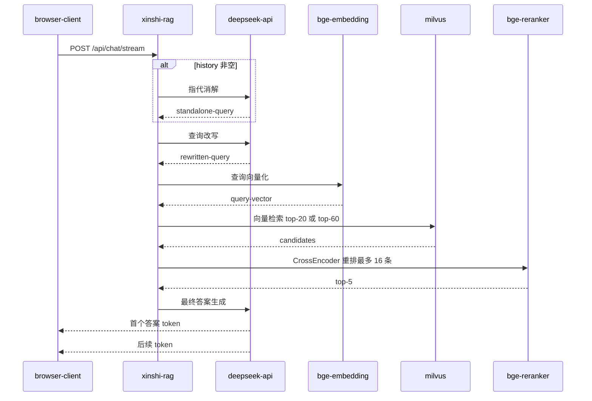
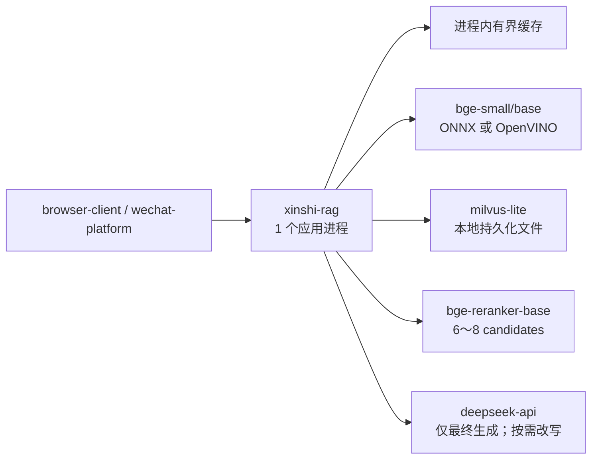
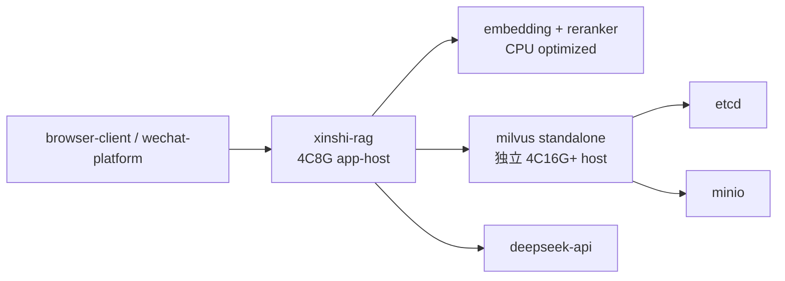

# xinshi-rag 在 4C8G CPU 服务器上的问答性能分析与优化设计

## 1. 文档目的

本文针对以下部署现状分析问答生成速度慢的原因，并给出可落地的优化方案：

- 单台 Ubuntu 服务器，4 核 CPU、8 GB 内存；
- 同机部署 Milvus Standalone、etcd、MinIO 和 `xinshi-rag`；
- 使用 `bge-base-zh-v1.5` 生成中文向量；
- 使用 `bge-reranker-base` 做 CrossEncoder 重排；
- 无 GPU 计划，Embedding 和 Reranker 均使用 CPU；
- 最终答案由远程 DeepSeek API 生成。

本文以当前仓库代码为事实来源，并参考 Milvus、Sentence Transformers、BAAI BGE 和 DeepSeek 的官方资料。本文只提出性能设计和改造顺序，不直接修改业务代码。

## 2. 核心结论

当前慢的主要原因大概率不是单一的 Milvus 查询，而是以下问题叠加：

1. **一次问答串行调用 2～3 次远程 LLM。** 默认开启 `use_rewrite` 时，单轮请求先调用一次完整 LLM 做查询改写，再执行检索和重排，最后再调用一次 LLM 生成答案；有历史消息时，还会先调用一次小模型做指代消解。所有步骤串行执行。
2. **4C8G 只达到 Milvus Standalone 自身的最低内存要求，却还要承载整个 RAG 应用。** Milvus 官方要求 Standalone 至少 8 GB 内存、建议 16 GB；当前 8 GB 还要分给操作系统、etcd、MinIO、Embedding、Reranker 和 Python 运行时，极易出现 CPU 争抢、内存回收甚至 swap。
3. **CrossEncoder 重排是 CPU 热点。** `bge-reranker-base` 会对查询和每个候选文档联合编码。当前最多重排 16 个候选，模型官方也明确说明 CrossEncoder 更准确但效率更低。
4. **查询 Embedding 也在应用进程内使用 CPU 实时计算。** 它与 Reranker、Milvus 搜索及并发请求共享 4 个 CPU 核。
5. **代码可能没有真正使用 Milvus。** `XINSHI_USE_MILVUS` 只有设置为 `1` 才启用 Milvus，但当前 Docker Compose 和 `.env.example` 都没有设置该变量；连接失败时还会静默回退到逐文档扫描的本地检索器。
6. **流式输出只能缩短最终生成阶段的感知等待，不能消除前置等待。** 当前 SSE 的首个答案 token 仍要等待指代消解、查询改写、Embedding、Milvus 搜索和 Reranker 全部完成。

优先级最高的方案是：**先量化每个阶段耗时；将正常单轮问答压缩为一次远程 LLM 调用；确认 Milvus 实际启用；减少重排候选；限制 CPU 并发；最后再决定升级机器、拆分 Milvus 或改用 Milvus Lite。**

## 3. 当前请求链路

### 3.1 代码事实

| 阶段 | 当前实现 | 性能特征 |
|---|---|---|
| 请求入口 | [`rag/chat_service.py`](../../rag/chat_service.py)、[`rag/server.py`](../../rag/server.py) | 普通问题进入同步 RAG 流程；SSE 只是生成阶段流式返回 |
| 指代消解 | `contextualize_for_search()` | history 非空时调用 `get_little_llm().invoke()`，增加一次远程网络往返 |
| 查询改写 | `query_rewrite()` | `use_rewrite` 默认为 `true`，调用的却是完整 `get_llm()` |
| 查询向量化 | [`rag/retriever.py`](../../rag/retriever.py) | `HuggingFaceEmbeddings` 在应用进程内实时计算查询向量 |
| 一阶段检索 | Milvus 或 `LocalVectorStore` | 普通问题取 20 条；教师/学生问题最多先取 60 条 |
| 二阶段重排 | [`rag/reranker.py`](../../rag/reranker.py) | CrossEncoder 最多计算 16 个查询-文档对，保留 5 条 |
| Prompt 构建 | `build_prompt()` | 拼接最多 5 个文档和 12 条历史消息 |
| 答案生成 | `get_llm().invoke()` 或 `.stream()` | 远程 DeepSeek 调用，默认最大输出 1024 tokens |

### 3.2 串行调用时序



因此当前首字延迟近似为：

```text
TTFT = 指代消解（可选）
     + 查询改写
     + 查询 Embedding
     + Milvus/本地检索
     + CrossEncoder 重排
     + 最终 LLM 网络与首 token 时间
```

流式接口只影响最后一项之后的展示方式。

## 4. 瓶颈分析与优先级

### 4.1 P0：查询改写造成额外的完整 LLM 调用

`ChatRequest.use_rewrite` 默认是 `true`，前端也固定发送 `true`。`query_rewrite()` 使用 `get_llm()`，与最终答案生成使用同一类大模型，而不是本地规则或小模型。

这意味着：

- 无历史的普通问题：至少 2 次串行远程 LLM 调用；
- 有历史的问题：至少 3 次串行远程 LLM 调用；
- 任意一次 API 排队、网络波动或 thinking 推理都会直接累加到总耗时；
- 即使 Milvus 查询只需几十毫秒，也可能被两次前置 LLM 请求完全掩盖。

另外，`get_little_llm()` 与 `get_llm()` 读取的是同一个 `DEEPSEEK_MAX_TOKENS`。当前 `.env.example` 配置为 1024，因此所谓“小模型改写”实际上也可能获得 1024 的最大输出预算，不符合“只返回一句话”的用途。

如果实际部署使用 Docker Compose 默认的 `deepseek-v4-pro`，当前代码没有显式设置 thinking 模式。DeepSeek 当前 API 文档显示该模型的 thinking 默认开启；应通过返回的 `reasoning_tokens` 验证实际状态，并在招生 FAQ、查询改写等低复杂度场景显式关闭。该结论是基于当前代码和官方接口默认值的推断，实际行为还取决于部署使用的模型别名及 `langchain-deepseek` 版本。

### 4.2 P0：4C8G 同机部署存在确定性的资源竞争

Milvus 官方当前列出的 Standalone 资源要求为：4 核或以上、至少 8 GB RAM，建议 16 GB RAM。当前整台机器只有 4C8G，相当于 Milvus 已经占满最低资源预算，应用却还需要运行：

- Python、FastAPI、Uvicorn；
- PyTorch CPU runtime；
- `bge-base-zh-v1.5`；
- `bge-reranker-base`；
- etcd 和 MinIO；
- Docker daemon、页缓存和操作系统服务。

在这种配置下，即使没有 OOM，也可能出现：

- Linux 频繁回收文件页和模型页；
- swap 换入换出导致延迟突然从秒级升到十几秒；
- PyTorch、Milvus 和多个请求线程同时抢占 4 个 CPU 核；
- 冷请求、并发请求和索引重建期间延迟显著抖动；
- 多个应用 worker 或副本重复加载两套模型，内存迅速耗尽。

当前两个 Compose 文件都没有配置 CPU、内存限制或保留量，无法阻止某个组件在高峰期挤压其他组件。

### 4.3 P0：Milvus 可能未实际启用或发生静默回退

[`rag/retriever.py`](../../rag/retriever.py) 只有在 `XINSHI_USE_MILVUS=1` 时才尝试构造 Milvus VectorStore。当前 [`rag/docker-install/docker-compose.yml`](../../rag/docker-install/docker-compose.yml) 与 [`rag/.env.example`](../../rag/.env.example) 都没有设置该变量。

即使设置了变量，连接、依赖或模型加载发生任何异常时，代码也只记录 warning，然后回退到 `LocalVectorStore`。本地检索会对全部 Markdown chunk 逐条执行 Python 词项统计和 `SequenceMatcher`，文档增长后会明显变慢。

因此不能以“Milvus 容器正在运行”推断“问答请求正在访问 Milvus”。必须在启动日志、健康检查和指标中暴露真实后端。

### 4.4 P1：CrossEncoder 重排在 CPU 上成本较高

当前重排流程最多处理 16 个候选，每个候选都要把查询和文档一起送入 Transformer。CrossEncoder 的优势是精度高，代价是不能像向量检索一样复用预计算文档向量。

当前配置还有以下放大因素：

- `RERANK_MAX_LENGTH=256`；
- `RERANK_DOC_CHAR_LIMIT=800`，仍可能在 tokenizer 后到达较长序列；
- `RERANK_BATCH_SIZE=64`，但候选上限只有 16，设置过大没有吞吐收益；
- 没有限制 PyTorch、OpenMP、MKL 的线程数；
- 微信后台线程池代码默认 6 个 worker，若环境未覆盖，多个重排会并发争抢 CPU；
- 用户说明部署使用 `bge-reranker-base`，但仓库 Compose 和配置默认仍是 `bge-reranker-large`，需要确认容器内最终生效路径，避免实际仍加载 large。

Sentence Transformers 官方支持 CrossEncoder 的 PyTorch、ONNX 和 OpenVINO 后端，其中 ONNX/OpenVINO 及 INT8 量化是 CPU 推理的主流优化路径。

### 4.5 P1：Embedding、检索数量和过滤顺序仍有优化空间

当前普通查询先取 20 条；命中教师或学生关键词时先取 `20 × 3 = 60` 条，然后才在 Python 中按 `audience_role` 过滤。更合理的路径是把角色作为 Milvus 标量字段，在向量搜索时直接过滤，避免先召回大量无关候选。

索引构建时设置了 `normalize_embeddings=True`，但在线检索创建 `HuggingFaceEmbeddings` 时没有显式设置相同的归一化参数。该不一致主要影响召回质量和分数阈值，但也可能间接迫使系统扩大 top-k 和使用更多改写/重排来补偿。

当前 HNSW 构建参数是 `M=8`、`efConstruction=64`，但在线搜索没有显式配置 `ef`。Milvus 官方说明，HNSW 的 `ef` 越大通常召回越高、搜索越慢，应通过本项目数据集压测选择，而不是盲目调大。

### 4.6 P1：Prompt 和答案配置放大最终生成耗时

当前最终 Prompt 最多包含 5 个文档和 12 条历史消息，答案最大输出为 1024 tokens。虽然提示词要求 250 字以内，但最大 token 限制仍然较大；当模型偏离格式或开启 thinking 时，总生成时间可能明显增加。

DeepSeek API 支持 SSE 流式 token，但流式只改善用户感知，不能减少模型实际推理量。应同时收紧 Prompt 和输出预算，并分别记录首 token 与完整结束时间。

### 4.7 P1：并发配置可能导致吞吐和延迟同时恶化

在 4 核 CPU 上，高并发不会让本地模型推理更快。多个请求同时进行 Embedding 和 CrossEncoder 推理时，底层线程池可能过度订阅 CPU。

尤其是微信路径：代码默认 `WECHAT_CUSTOM_REPLY_WORKERS=6`，虽然示例环境配置为 2，但实际部署缺少该变量时会回到 6。对 4C8G CPU-only 主机，建议将本地模型并发限制在 1～2，并使用有界队列提供背压。

## 5. 主流 RAG 设计对照

当前“Bi-Encoder 召回 + CrossEncoder 重排 + LLM 生成”的总体方向是主流的两阶段检索方案。Sentence Transformers 官方同样推荐先使用高效 Bi-Encoder 获取候选，再只对有限候选使用更准确但更慢的 CrossEncoder。

问题不在于使用了两阶段方案，而在于当前资源预算和执行策略不匹配：

| 主流实践 | 当前实现 | 建议调整 |
|---|---|---|
| 快速一阶段召回 | BGE Embedding + Milvus，方向正确 | 确认 Milvus 真正启用，加入元数据过滤和查询缓存 |
| 有限候选二阶段重排 | 最多 16 条 | 4C CPU 先降为 6～8 条，最终保留 3 条 |
| 按需查询改写 | 每个请求默认调用完整 LLM | 清晰单轮问题不改写；含指代追问才改写 |
| 流式生成 | 已支持 SSE | 增加 TTFT 指标，并让前置阶段更短 |
| 模型服务资源隔离 | Milvus、Embedding、Reranker 同机争抢 | 小数据改用 Lite，或把 Milvus迁到独立资源 |
| CPU 推理加速 | 默认 PyTorch FP32 | 评估 ONNX/OpenVINO INT8，限制线程与并发 |
| 可观测性驱动调参 | 只有部分阶段日志 | 补齐全链路分段耗时、token、资源和后端指标 |

## 6. 推荐目标架构

### 6.1 推荐方案 A：小型知识库继续使用单机 4C8G

若知识库规模远低于百万向量，优先评估 Milvus Lite。Milvus 官方将 Lite 定位为小规模向量搜索，并说明其适合最多数百万向量的较小数据集。它可以省去独立的 Milvus、etcd、MinIO 容器，显著减少 8 GB 主机上的基础设施开销。



适用条件：

- 知识库规模小；
- 单实例可以满足可用性要求；
- 可以接受应用与向量库同生命周期；
- 先做数据备份和离线迁移验证。

### 6.2 推荐方案 B：保留 Milvus Standalone

若必须保留独立 Milvus，建议至少选择以下一种方式：

1. 将 Milvus、etcd、MinIO 迁到独立的 4C16G 或更高配置主机；应用服务器保留 Embedding 和 Reranker。
2. 将当前单机升级到至少 8C16G，再通过容器限制和监控划分资源。
3. 把 Embedding/Reranker 迁到独立 CPU 推理服务，Milvus 留在当前主机；但当前 8 GB 仍低于整机安全余量，不是首选。



### 6.3 CUDA 结论

本方案不需要安装 CUDA。CUDA 只用于 NVIDIA GPU 加速；当前 Dockerfile 已安装 CPU-only PyTorch。没有 GPU 时安装 CUDA 不会提高速度，还会增加镜像、驱动和运维复杂度。CPU 优化应优先使用 ONNX Runtime、OpenVINO、INT8 量化、线程限制和更小的候选集。

## 7. 分阶段解决方案

### 7.1 第一阶段：先定位，不换模型

这是最高优先级，建议先完成再决定是否扩容。

#### 7.1.1 增加全链路指标

每个请求记录以下字段：

| 指标 | 说明 |
|---|---|
| `request_total_ms` | 从接收请求到结束 |
| `contextualize_ms` | 指代消解耗时，未执行时为 0 |
| `rewrite_ms` | 查询改写耗时，未执行时为 0 |
| `embedding_search_ms` | 查询 Embedding 与 Milvus 搜索当前无法分离时先合并记录 |
| `rerank_ms` | CrossEncoder 耗时 |
| `prompt_chars` / `prompt_tokens` | 最终输入大小 |
| `llm_ttft_ms` | 最终答案首 token 延迟 |
| `llm_total_ms` | 最终答案完整生成时间 |
| `completion_tokens` | 输出 token 数 |
| `reasoning_tokens` | 判断是否启用了 thinking |
| `retriever_backend` | `milvus` 或 `local` |
| `retrieved_count` / `rerank_count` | 候选数量 |
| `cache_hit` | 查询、检索、重排缓存是否命中 |

日志必须带 `request_id`，否则并发时无法拼接一次请求的所有阶段。

#### 7.1.2 核对主机资源

在冷启动、单并发、2 并发、4 并发和索引重建时分别采集：

```bash
docker stats --no-stream
free -h
vmstat 1
pidstat -u -r -d 1
```

重点观察：

- `available` 内存是否持续低于 1 GB；
- swap 是否非零且持续发生 `si/so`；
- CPU load 是否长期高于 4；
- app、milvus、etcd、minio 的 RSS；
- Reranker 执行时 CPU 是否满载；
- Milvus 搜索耗时是否其实远小于 LLM 和 Reranker。

#### 7.1.3 确认真正的运行配置

启动时必须输出并在健康检查中返回以下非敏感信息：

- `retriever_backend=milvus|local`；
- Milvus host、port、collection 和索引 metric；
- Embedding 模型路径、device、backend；
- Reranker 模型路径、device、backend、candidate limit；
- DeepSeek 模型名称、thinking 是否开启；
- 应用进程数和本地模型并发上限。

生产环境配置为必须使用 Milvus 时，连接失败应直接使 readiness 失败，不能静默切换到另一种性能和数据范围都不同的实现。

### 7.2 第二阶段：低风险配置优化

建议先以以下值建立基线，再用质量评测调整：

| 配置 | 当前值 | 4C8G 建议起点 | 说明 |
|---|---:|---:|---|
| 单轮远程 LLM 调用 | 2 次 | 1 次 | 清晰问题跳过查询改写 |
| 有历史远程 LLM 调用 | 3 次 | 1～2 次 | 仅检测到指代/省略时消歧，不再二次同义词改写 |
| `TOP_K_RETRIEVE` | 20 | 8～12 | 用离线 Recall@K 验证 |
| `ROLE_FILTER_MULTIPLIER` | 3 | 1 | 改为 Milvus 标量过滤后不再扩大 3 倍 |
| `RERANK_CANDIDATE_LIMIT` | 16 | 6～8 | CPU 延迟与候选数近似线性相关 |
| `TOP_K_RERANK` | 5 | 3 | 学校 FAQ 通常无需 5 个长上下文 |
| `RERANK_MAX_LENGTH` | 256 | 192 | 结合当前 chunk_size=256 验证截断损失 |
| `RERANK_BATCH_SIZE` | 64 | 8 | 与候选规模一致 |
| `MAX_HISTORY_MESSAGES` | 12 | 4～6 | 控制改写和最终 Prompt 长度 |
| 答案 `max_tokens` | 1024 | 256～384 | 与 250 字目标一致，保留少量余量 |
| 改写 `max_tokens` | 与答案共用 | 32～64 | 新增独立环境变量 |
| 微信模型 worker | 代码默认 6 | 1～2 | 4 核 CPU 下提供背压 |
| OpenMP/MKL 线程 | 未设置 | 每进程 2，压测后调整 | 防止底层线程过度订阅 |

建议新增环境变量，而不是继续写死常量：

```text
TOP_K_RETRIEVE=10
TOP_K_RERANK=3
MAX_HISTORY_MESSAGES=6
DEEPSEEK_ANSWER_MAX_TOKENS=384
DEEPSEEK_REWRITE_MAX_TOKENS=64
RERANK_CANDIDATE_LIMIT=8
RERANK_MAX_LENGTH=192
RERANK_BATCH_SIZE=8
MODEL_INFERENCE_CONCURRENCY=1
OMP_NUM_THREADS=2
MKL_NUM_THREADS=2
```

这些值是压测起点，不是未经验证的生产最终值。

### 7.3 第三阶段：重构查询改写策略

推荐将查询改写改成三级路由：

1. **无需改写：** 清晰完整的单轮问题直接检索，例如“学校地址在哪里”“学费是多少”。
2. **本地规则扩展：** 地址、面积、校长、师资、费用、招生等已知领域词，直接使用当前 `_expand_query()` 类似的确定性规则，不访问远程 LLM。
3. **按需 LLM 消歧：** 只有 history 非空且问题包含“那里、这个、还有吗、呢、同上”等指代或明显省略时，调用小模型生成 standalone query。

目标是：

- 80% 以上普通 FAQ 只调用一次远程 LLM，即最终答案生成；
- 同一个请求最多执行一次查询改写，不再先消歧再同义词改写；
- 改写失败或超时后直接使用原问题检索，不阻断答案；
- 对规范化问题和改写结果设置短时 LRU 缓存。

### 7.4 第四阶段：优化 Reranker CPU 推理

按以下顺序实施：

1. 将候选从 16 降至 8，并评估 Recall@8、MRR、nDCG 和答案正确率；
2. 统一使用实际声明的 `bge-reranker-base`，启动日志输出模型目录；
3. 导出并持久化 ONNX/OpenVINO 模型，禁止每次启动临时导出；
4. 在目标 CPU 上比较 PyTorch、ONNX、ONNX INT8、OpenVINO、OpenVINO INT8；
5. 用 100～300 条真实中文招生问句验证量化前后的排序差异；
6. 为 Reranker 增加并发信号量，4C 主机先限制为 1；
7. 对完全相同的规范化查询和 chunk 保留现有分数缓存，同时增加命中率指标。

不要仅凭通用 benchmark 直接选择 backend。Sentence Transformers 官方也强调应在实际文本长度和硬件上比较不同后端。

### 7.5 第五阶段：优化 Embedding 与 Milvus

1. 在线查询 Embedding 与索引构建统一 `device=cpu`、`normalize_embeddings=True` 和相同模型版本；
2. 为常见规范化查询缓存 embedding 向量；
3. 将 `audience_role` 作为 Milvus 标量过滤表达式，在 ANN 搜索阶段过滤；
4. 显式配置并压测 HNSW `ef`，从接近 top-k 的小值开始逐步提高；
5. 小知识库对比 HNSW 与 FLAT。数据量很小时，复杂 ANN 索引未必比精确搜索更有收益；
6. 如果 Embedding 仍是显著热点，评估 `bge-small-zh-v1.5` 或 Embedding 的 ONNX/OpenVINO INT8。

BAAI 官方模型卡显示 `bge-small-zh-v1.5` 的模型层数和向量维度更小，但中文 C-MTEB 指标低于 base。因此它是“用质量换延迟和内存”的选项，必须通过本项目问答集做 A/B 测试，不能直接替换。

### 7.6 第六阶段：优化最终生成

1. 最终答案保留 SSE 流式输出；
2. 记录真正的首答案 token 时间，不把 `meta` 事件当作 TTFT；
3. Prompt 默认只拼接 top-3 文档；
4. 历史只保留最近 4～6 条，或异步维护会话摘要；
5. 答案输出限制为 256～384 tokens；
6. 对招生 FAQ 关闭 thinking，复杂问题再按路由开启；
7. 复用 LLM client/model 对象，避免每个阶段重新构造 `ChatDeepSeek`；
8. 配置连接超时、读取超时和一次有界重试，防止请求无限拖长；
9. 对高频稳定问答增加短时答案缓存，并在知识库重建后按版本失效。

## 8. 建议的性能目标

以下是优化后的建议目标，需要在真实服务器上验证：

| 指标 | 建议目标 | 备注 |
|---|---:|---|
| 清晰单轮问题远程 LLM 调用数 | 1 | 只做最终生成 |
| 前置处理 P50 | ≤ 500 ms | 改写、检索、重排之和，不含最终 LLM |
| 前置处理 P95 | ≤ 1,000 ms | 目标值，不是当前实测 |
| Milvus 检索 P95 | ≤ 150 ms | 含网络，不含查询 Embedding时更容易达到 |
| Reranker P95 | ≤ 400 ms | 8 candidates，CPU 优化后目标 |
| 最终答案 TTFT P95 | ≤ 3 s | 受 DeepSeek 网络和服务端排队影响 |
| 250 字内答案完成 P95 | ≤ 8 s | 受模型吞吐影响 |
| swap in/out | 0 | 在线服务稳定阶段不应持续 swap |
| 错误回退可见性 | 100% | Milvus/local、PyTorch/local fallback 必须可观测 |

## 9. 压测与质量验证方案

### 9.1 测试集

准备至少 100 条真实或脱敏的中文招生问题，覆盖：

- 地址、收费、报名、住宿、师资、校长、校园面积；
- 同义表达、错别字、口语化问题；
- 2～4 轮带指代的追问；
- 无答案问题；
- 教师、学生和通用角色问题；
- 高频重复问题，用于验证缓存。

每条问题标注：正确文档、期望答案要点、是否需要改写。

### 9.2 对照组

| 组别 | 配置 |
|---|---|
| A | 当前配置 |
| B | 关闭查询改写，仅保留最终生成 |
| C | B + rerank candidates=8、top-3 |
| D | C + ONNX/OpenVINO Reranker |
| E | D + Milvus 标量过滤和查询缓存 |
| F | E + Milvus Lite 或 Milvus 独立主机 |

### 9.3 测试维度

- 冷启动后首个请求；
- 模型预热后的请求；
- 并发 1、2、4；
- 单轮和多轮；
- 命中缓存与未命中缓存；
- 文档数量扩大到当前的 10 倍；
- Milvus 正常、Milvus 不可达、DeepSeek 超时。

### 9.4 验收指标

性能指标：P50/P95/P99 TTFT、完整耗时、QPS、CPU、RSS、swap、各阶段耗时。

质量指标：Recall@K、MRR/nDCG、正确文档命中率、答案要点覆盖率、无依据回答率。

只有同时满足“延迟下降且质量不低于约定阈值”的方案才能上线。建议初始要求：答案要点正确率下降不超过 2 个百分点，无依据回答率不能上升。

## 10. 实施顺序与预期收益

| 顺序 | 改造项 | 成本 | 预期收益 |
|---:|---|---|---|
| 1 | 补齐阶段耗时、TTFT、token、backend 和资源指标 | 低 | 明确真正瓶颈，避免盲目优化 |
| 2 | 验证并显式设置 `XINSHI_USE_MILVUS=1`，生产失败即 readiness 失败 | 低 | 排除静默本地扫描 |
| 3 | 清晰问题跳过远程查询改写，拆分改写 token 配置 | 低～中 | 通常是首字延迟最大降幅 |
| 4 | 关闭低复杂度请求 thinking，答案 max_tokens 调到 256～384 | 低 | 降低远程生成耗时和波动 |
| 5 | rerank candidates 16→8、top-5→top-3、并发限制 1～2 | 低 | 直接减少 CPU 计算和争抢 |
| 6 | Milvus 元数据前置过滤，Embedding 参数一致化 | 中 | 降低无效候选并改善召回稳定性 |
| 7 | Reranker/Embedding 使用 ONNX 或 OpenVINO INT8 | 中 | 降低 CPU 时间和模型内存 |
| 8 | 小数据改 Milvus Lite，或把 Standalone 迁到独立 16G 主机 | 中～高 | 从根本上解决 8 GB 主机资源冲突 |

## 11. 建议立即执行的检查清单

- [ ] 查看应用启动日志，确认 `retriever_backend` 是否真的是 Milvus；
- [ ] 检查容器环境变量是否包含 `XINSHI_USE_MILVUS=1`；
- [ ] 检查实际 Reranker 路径是 base 还是仓库默认的 large；
- [ ] 记录一次请求中 `contextualize`、`rewrite`、`retrieve`、`rerank`、LLM TTFT 和完整生成时间；
- [ ] 查看 DeepSeek usage 中是否存在大量 `reasoning_tokens`；
- [ ] 通过 `free -h`、`vmstat 1` 和 `docker stats` 检查 swap 与内存压力；
- [ ] 临时令 `use_rewrite=false` 做同一批问题 A/B 对比；
- [ ] 临时将 rerank candidates 改为 8 做延迟/质量对比；
- [ ] 将微信 worker 限制为 1～2，测试并发 1、2、4；
- [ ] 根据向量数量决定继续使用 Standalone，还是评估 Milvus Lite。

## 12. 参考资料

- [Milvus Standalone 安装资源要求](https://milvus.io/docs/prerequisite-docker.md)：Standalone 至少 8 GB RAM，建议 16 GB；建议 4 核以上。
- [Milvus 部署方式概览](https://milvus.io/docs/install-overview.md)：Lite、Standalone、Distributed 的适用规模；Lite 推荐用于较小数据集。
- [Milvus 标量索引与过滤](https://milvus.io/docs/scalar_index.md)：向量搜索可结合标量字段过滤，缩小搜索范围。
- [Milvus HNSW 参数](https://milvus.io/docs/hnsw-sq.md)：`M`、`ef` 对召回率、内存和搜索耗时的影响。
- [Sentence Transformers：Retrieve & Re-Rank](https://www.sbert.net/examples/sentence_transformer/applications/retrieve_rerank/README.html)：Bi-Encoder 召回与 CrossEncoder 重排的两阶段设计。
- [Sentence Transformers：CrossEncoder 推理加速](https://www.sbert.net/docs/cross_encoder/usage/efficiency.html)：PyTorch、ONNX、OpenVINO 与量化方案。
- [Sentence Transformers：Embedding 推理加速](https://www.sbert.net/docs/sentence_transformer/usage/efficiency.html)：Embedding 的 ONNX、OpenVINO 与 INT8 优化。
- [BAAI BGE 模型卡](https://huggingface.co/BAAI/bge-base-zh-v1.5)：中文 BGE 各尺寸模型指标与 Embedding 维度对比。
- [BAAI bge-reranker-base 模型卡](https://huggingface.co/BAAI/bge-reranker-base/blob/main/README.md)：CrossEncoder Reranker 的精度与效率定位。
- [DeepSeek Chat Completions API](https://api-docs.deepseek.com/api/create-chat-completion/)：stream、max_tokens、thinking 和 usage 字段定义。

## 13. 最终建议

对于当前 4C8G 服务器，建议选择以下落地路线：

1. 本周先完成指标、关闭无条件远程查询改写、将重排候选降至 8、限制并发，并确认没有 swap；
2. 知识库规模较小时，将 Milvus Standalone 替换为 Milvus Lite，继续保持 CPU-only，不安装 CUDA；
3. 必须保留 Standalone 时，将 Milvus 迁到独立 4C16G 或更高配置机器，或把单机整体升级到至少 8C16G；
4. 在目标 CPU 上评估 Reranker 的 ONNX/OpenVINO INT8，再决定是否将 Embedding 从 base 换为 small；
5. 所有性能优化都要同时用中文招生问答集验证召回和答案质量。

综合当前代码，**最值得先做的不是更换 Milvus 索引或安装 CUDA，而是消除不必要的串行 LLM 调用、确认实际检索后端、压缩 CrossEncoder 候选，并解决 8 GB 内存上的组件争抢。**
